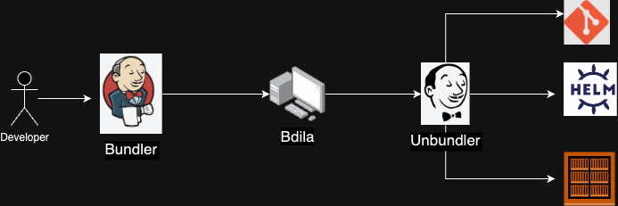

import Tabs from '@theme/Tabs';
import TabItem from '@theme/TabItem';

# Overview

We store all our helm charts of all the teams under the [helm-charts repository](https://github.com/MapColonies/helm-charts)

This repository is a mono repo, where each team has it’s own `scope` for example, `3D` team has it’s own directory where the team is storing their helm charts.  

<u>Here’s the repo structure:</u>    
```bash
- /
  - 3D/
    - Umbrella chart
    - deployment.json
    - artifacts.json
  - raster/
    - Umbrella chart
    - deployment.json
    - artifacts.json
```

## Release Workflow

We can see the diagram of the Release workflow below


### CI part

The release workflow begins with a new release or tag push on each service repository and it's happening via Github Actions workflows.

The workflows are being triggered automatically.  
If we take a look at a sample repo `store-trigger` it has a workflow called `Build and push artifacts` , where the source of this can be found [here](https://github.com/MapColonies/store-trigger/blob/master/.github/workflows/build-and-push.yaml)

The workflow is building the dokcer image of the service, tagging it and pushing it to `Azure ACR`, along with the docker image it's also pushing the helm package which is part of the repository.  
Afterwards it's updating the `artifacts.json` which is associated with the team's `scope` under the [helm-charts repository](https://github.com/MapColonies/helm-charts) with the new releases which have been just released.  

### CD part

We're utilizing [Jenkins](https://jenkins.mapcolonies.net/) for this purpose.

#### How to login?

Each team has their own set of credentials which they can use to login to the jenkins instance.

We have 2 options for deployment:

1. Manual deployment
2. Auto Deploy

#### Manual deployment

The manual deployment is happening on our Jenkins instance.  
The pipeline name is [Deploy-Chart](https://jenkins.mapcolonies.net/job/Deploy-Chart/).

How to use it?

* Click on the `Build with parameters` button  


* In the next screen you'll need to fill up the parameters:
  * `BRANCH` - is the list of the auto populated branches from the `helm-charts` repo.
  * `NAMESPACE` - is the namespace where do you wish to deploy the chart
  * `VALUES_FILE` - is the values file which you want to use for the deployment
  * `RELEASE_NAME` - is the release name which you want to create or upgrade
  * `CHART_DIRECTORY_LOCATION` - is the relative path of the directory which holds the chart you wishi to deploy (E.G `infra/monitoring`)

You can see how it looks with the pre-filled params.  


* After filling up the parameters, click on the `Build` button
* When the build will kickoff it'll send a message in `<team>-notifications` channel in Slack that it has started and after it has finished it'll also send another message.  

#### Auto deployment

The auto deployment process is currently monitoring the following branches: `master` and `qa`. On each commit to the [helm-charts repository](https://github.com/MapColonies/helm-charts) on the monitored branch the pipeline is kicking off.

The pipeline can be found [here](https://jenkins.mapcolonies.net/job/Deploy%20Chart%20Polling%20-%20Multibranch/)  
As you can see in the overview page of the pipeline there are 2 branches which it's monitoring.

  

##### How the auto deploy pipeline is working?

* The pipeline is first of all looking at changes introduced in each commit with a `git diff`.
* After finding the `diff` it'll look at the `deployment.json` in the `scope` (each team's directory in the `helm-charts` repo) directories.
* Here's an example of `deployment.json` file

```json
[
    {
      "chartLocation": "3d/charts/ingestion",
      "valuesFile": ["3d/charts/global-values.yaml", "3d/charts/ingestion/ingestion-values.yaml"],
      "namespace": "3d-dev",
      "releaseName": "ingestion-3d",
      "skip": false
    },
    {
      "chartLocation": "3d/charts/serving",
      "valuesFile": ["3d/charts/global-values.yaml", "3d/charts/serving/serving-values.yaml"],
      "namespace": "3d-dev",
      "releaseName": "serving-3d",
      "skip": true
    }
  ]
```  

* If you wish to skip a deployment you'll need to have `"skip": true` in the chart you wish to skip.
* When the pipeline will start it'll send a slack message to the `<team>-notifications` channel based on chart location(s) which are going to be deployed.  
 
* After the pipeline will finish it'll send another message to the `<team>-notifications` channel based on chart location(s) which have been deployed with the status of the deployment.  

## Bundler/Unbundler

The bundler and unbundler workflows are intended to help our dev team to bring in the artifacts which were built in the release flow in an easy way to our internal deployments.

We utilize Jenkins for the bundler and unbundler. 


 

### Bundler pipeline

The [bundler pipeline](https://jenkins.mapcolonies.net/job/bundler/) has 1 parameter which is the `artifacts.json` file.

Here's an example of the `artifacts.json` 


```json
{
  "docker": {
    "acrarolibotnonprod.azurecr.io": {
      "3d-gateway": "v2.4.2",
      "store-trigger": "v1.5.2"
    },
    "docker.io": {
      "bitnami/redis": "7.2.3",
      "timonwong/uwsgi-exporter": "latest"
    }
  },
  "helm": {
    "acrarolibotnonprod.azurecr.io": {
      "gateway": "2.4.2",
      "store-trigger": "1.5.2"
    },
    "https://charts.bitnami.com/bitnami": {
      "redis": "18.5.0"
    }
  },
  "git": [
    "MapColonies/helm-charts"
  ]
}
```  

The bundler pipeline will bundle all the artifacts (docker tar balls, helm packages, git repos) into 1 zip file.

Once the bundler is done it'll send a slack message to the `<team>-notifications` channel based on the user logged in.


### Unbundler pipeline

The unbundler pipeline is happening internally in every network we have.
After copying over the `bundle` file to the relevant network, there will be an unbundler pipeline on the jenkins.

The unbundler pipeline is performing the following:

* For each docker tar ball it'll attempt to push the docker image with the same tag to all the docker registries available in all the sites.
* For each helm package it'll attempt to push the helm package with the same version and name to all the helm registries available in all the sites.
* For each git repository it'll attempt to open a PR/MR from the source `master` branch to the destination repository internally to the `master` branch.
