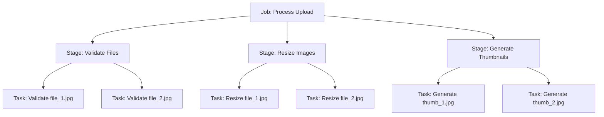
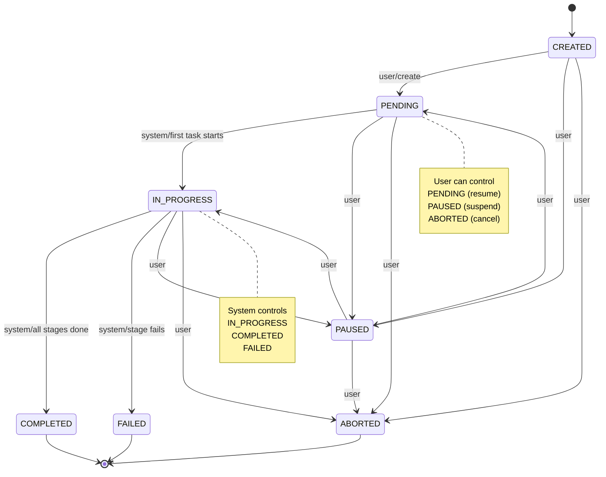
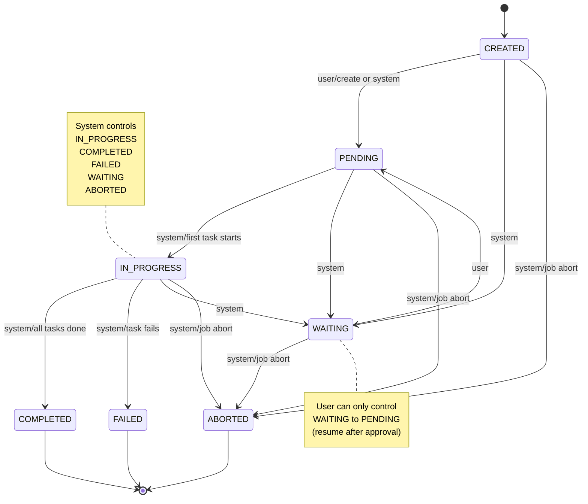
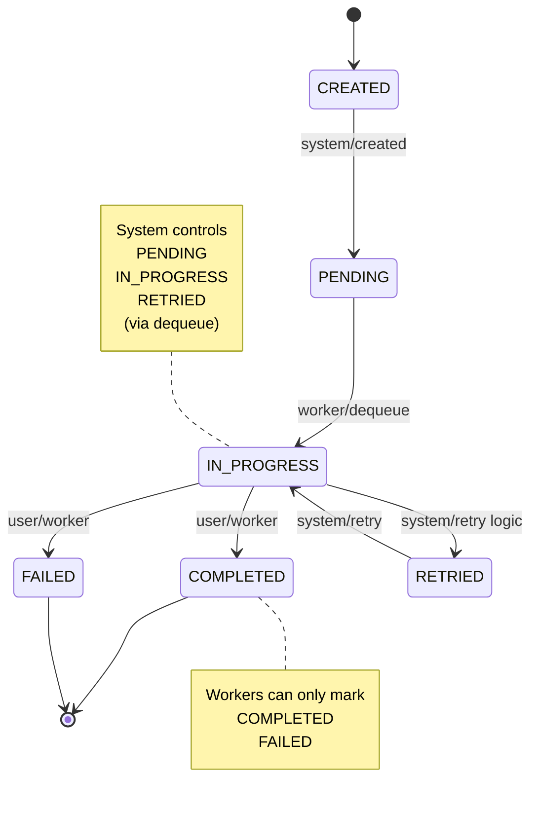
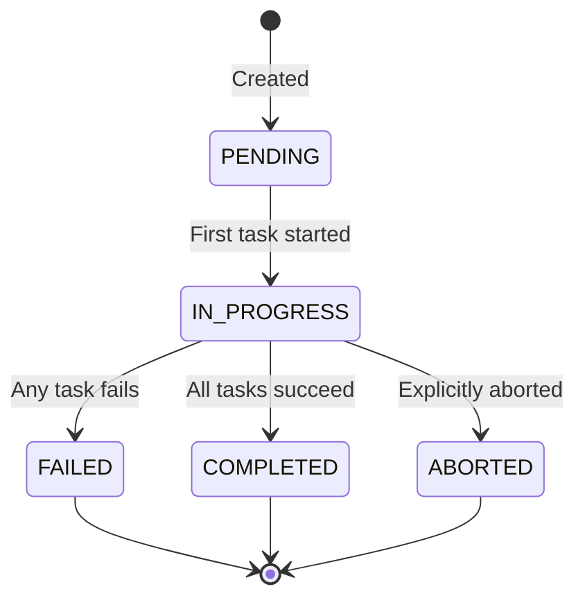

import Tabs from '@theme/Tabs';
import TabItem from '@theme/TabItem';

# From Zero to Hero

Step by step guide on how to integrate the MapColonies™ Jobnik Job Management system into your distributed workflows.

### Assumptions

This guide assumes that you have:
- Basic understanding of distributed systems and asynchronous task processing
- Familiarity with TypeScript and Node.js (>= 24.0.0)
- Access to a Jobnik Manager instance
- An understanding of your workflow requirements (jobs, stages, and tasks)

For background on the Jobnik architecture, see the [Jobnik Knowledge Base](/docs/knowledge-base/jobnik/README.md).

## Before we start

The implementation of a Jobnik-based workflow consists of the following steps:
1. Understanding the Jobnik hierarchy (Jobs, Stages, Tasks)
2. Setting up your project environment
3. Defining your custom job and stage types
4. Implementing a Producer service (creating work)
5. Implementing a Worker service (processing work)

Below, each step is explained in detail.

---

## Understanding the Jobnik Hierarchy

Jobnik uses a three-level hierarchy to organize work:

- **Job**: The root entity representing an entire workflow (e.g., "Process User Upload")
- **Stage**: A logical grouping of similar tasks within a job (e.g., "Image Resizing")
- **Task**: An atomic unit of work to be executed (e.g., "Resize image_001.jpg")



**Key Concepts:**
- Each Job can have multiple Stages
- **Stages are ordered sequentially** - each stage has an `order` field (1, 2, 3, etc.)
- Stages execute in order - a stage cannot transition to `PENDING` until the previous stage completes
- Each Stage can have multiple Tasks
- Tasks are processed independently by Workers
- The Manager enforces valid state transitions

---

## State Transitions: User vs System Control

Understanding which state transitions are **user-controlled** (via API) versus **system-controlled** (automatic) is crucial for working with Jobnik effectively.

### Job State Transitions

Jobs follow a state machine with both manual and automatic transitions:



**User-Controlled Job Transitions (via API):**
- ✅ **PENDING**: Resume a paused job or explicitly start a created job
- ✅ **PAUSED**: Temporarily suspend job processing
- ✅ **ABORTED**: Cancel the job permanently

**System-Controlled Job Transitions (Automatic):**
- 🤖 **CREATED → PENDING**: Automatically set when job is created
- 🤖 **PENDING → IN_PROGRESS**: Triggered when the first task in the first stage starts processing
- 🤖 **IN_PROGRESS → COMPLETED**: Triggered when all stages are completed
- 🤖 **IN_PROGRESS → FAILED**: Triggered when a stage fails

```typescript
// User-controlled: Pause a running job
await fetch(`${managerUrl}/v1/jobs/${jobId}/status`, {
  method: 'PUT',
  headers: { 'Content-Type': 'application/json' },
  body: JSON.stringify({ status: 'PAUSED' })
});

// User-controlled: Resume a paused job
await fetch(`${managerUrl}/v1/jobs/${jobId}/status`, {
  method: 'PUT',
  headers: { 'Content-Type': 'application/json' },
  body: JSON.stringify({ status: 'PENDING' })
});

// User-controlled: Abort a job
await fetch(`${managerUrl}/v1/jobs/${jobId}/status`, {
  method: 'PUT',
  headers: { 'Content-Type': 'application/json' },
  body: JSON.stringify({ status: 'ABORTED' })
});

// ❌ ILLEGAL: Cannot manually set to IN_PROGRESS, COMPLETED, or FAILED
// These are system-managed based on task/stage completion
```

### Stage State Transitions

Stages have more restricted user control - most transitions are automatic:



**User-Controlled Stage Transition (via API):**
- ✅ **WAITING → PENDING**: Resume a stage that was waiting for manual approval/intervention

**System-Controlled Stage Transitions (Automatic):**
- 🤖 **CREATED → PENDING**: Automatically set when stage is created (if first stage or previous stage is COMPLETED)
- 🤖 **CREATED → WAITING**: System can set stage to wait for external conditions
- 🤖 **PENDING → IN_PROGRESS**: Triggered when the first task in the stage starts
- 🤖 **IN_PROGRESS → COMPLETED**: Triggered when all tasks in the stage complete successfully
- 🤖 **IN_PROGRESS → FAILED**: Triggered when any task reaches max retries and fails permanently
- 🤖 **Any → ABORTED**: Cascaded from job abortion

**Stage Ordering Constraints:**
- Stages are ordered sequentially (order: 1, 2, 3...)
- A stage with `order: 2` cannot transition to `PENDING` until stage with `order: 1` is `COMPLETED`
- This enforces sequential workflow execution

```typescript
// User-controlled: Resume a waiting stage (e.g., after manual approval)
await fetch(`${managerUrl}/v1/stages/${stageId}/status`, {
  method: 'PUT',
  headers: { 'Content-Type': 'application/json' },
  body: JSON.stringify({ status: 'PENDING' })
});

// ❌ ILLEGAL: Cannot manually set to other statuses
// IN_PROGRESS, COMPLETED, FAILED, ABORTED are system-managed

// ❌ ILLEGAL: Cannot skip stage order
// Stage 2 cannot go to PENDING if Stage 1 is not COMPLETED
```

### Task State Transitions

Tasks have very limited user control - workers can only mark them as done:



**User-Controlled Task Transitions (via Worker API):**
- ✅ **IN_PROGRESS → COMPLETED**: Worker successfully completes the task
- ✅ **IN_PROGRESS → FAILED**: Worker fails the task (after max retries)

**System-Controlled Task Transitions (Automatic):**
- 🤖 **CREATED → PENDING**: Automatically set when task is created
- 🤖 **PENDING → IN_PROGRESS**: Triggered when a worker dequeues the task
- 🤖 **IN_PROGRESS → RETRIED**: System retries if attempts < maxAttempts after failure
- 🤖 **RETRIED → IN_PROGRESS**: Task re-enters queue for another attempt

**Dequeue Operation:**
The dequeue operation is special - it atomically moves a task from `PENDING` to `IN_PROGRESS`:

```typescript
// Worker dequeues a task (system automatically sets IN_PROGRESS)
const task = await worker.dequeueTask('resize-images');
// Task is now IN_PROGRESS

try {
  // Process the task
  await processImage(task.data);
  
  // User-controlled: Mark as completed
  await worker.updateTaskStatus(task.id, 'COMPLETED');
} catch (error) {
  // User-controlled: Mark as failed
  await worker.updateTaskStatus(task.id, 'FAILED');
}

// ❌ ILLEGAL: Cannot manually set to PENDING or IN_PROGRESS
// These are managed by the dequeue operation
```

### Cascading Effects

State transitions often cascade through the hierarchy:

**Task → Stage → Job:**
1. **All tasks in stage complete** → Stage becomes `COMPLETED`
2. **All stages in job complete** → Job becomes `COMPLETED`
3. **Any task fails permanently** → Stage becomes `FAILED` → Job becomes `FAILED`

**Job Abortion Cascades Down:**
1. User aborts job → Job becomes `ABORTED`
2. All stages cascade to `ABORTED`
3. All in-progress tasks should be cancelled (not implemented yet, planned for future)

**Stage Ordering:**
1. Stage 1 completes → Stage 2 can transition to `PENDING`
2. Stage 2 starts processing → Stage 3 remains in `CREATED` or `WAITING`

### Summary Table

| Entity | User-Controlled Statuses | System-Controlled Statuses | API Endpoint |
|--------|-------------------------|---------------------------|--------------|
| **Job** | PENDING, PAUSED, ABORTED | IN_PROGRESS, COMPLETED, FAILED, CREATED | `PUT /v1/jobs/{jobId}/status` |
| **Stage** | PENDING (from WAITING only) | IN_PROGRESS, COMPLETED, FAILED, ABORTED, WAITING, CREATED | `PUT /v1/stages/{stageId}/status` |
| **Task** | COMPLETED, FAILED | PENDING, IN_PROGRESS, RETRIED, CREATED | `PUT /v1/tasks/{taskId}/status` |

### Best Practices for State Management

1. **System-managed transitions are non-negotiable**: The state machine is enforced by the Manager
2. **Use PAUSED for temporary suspension**: If you need to temporarily stop work, use job-level PAUSED status
3. **Use WAITING for approval workflows**: If a stage needs manual approval, the system can set it to WAITING, then user can resume via PENDING
4. **Handle ABORTED gracefully**: Workers should check task/job status and handle abortion scenarios
5. **Monitor for FAILED states**: Set up alerting for jobs/stages that enter FAILED state
6. **Respect stage ordering**: Skipping or reordering stages is impossible - the system strictly enforces sequential execution

---

## Data Structure Explained

Understanding the structure of Jobs, Stages, and Tasks is crucial for working with Jobnik. Each entity has specific fields and serves a different purpose in the workflow.

### Job Structure

A **Job** is the root entity that represents an entire workflow. When you create a job, you provide:

<Tabs>
<TabItem value="create" label="Creating a Job">

```typescript
const job = await producer.createJob({
  name: 'image-processing',        // Job type name
  data: {                           // Business data for the job
    uploadId: 'upload-123',
    userId: 'user-456',
    totalFiles: 10
  },
  userMetadata: {                   // Additional metadata
    priority: 'HIGH',
    requestTimestamp: '2026-02-17T10:00:00Z'
  },
  priority: 'HIGH'                  // Job priority (VERY_HIGH, HIGH, MEDIUM, LOW, VERY_LOW)
});
```

</TabItem>
<TabItem value="response" label="Job Response">

```typescript
// The created job object returned by the API
{
  id: 'job-uuid-123',                // Unique identifier
  name: 'image-processing',          // Job type
  status: 'PENDING',                 // Current status
  data: {                            // Your business data
    uploadId: 'upload-123',
    userId: 'user-456',
    totalFiles: 10
  },
  userMetadata: {                    // Your metadata
    priority: 'HIGH',
    requestTimestamp: '2026-02-17T10:00:00Z'
  },
  priority: 'HIGH',                  // Job priority
  createdAt: '2026-02-17T10:00:00Z', // Timestamp
  updatedAt: '2026-02-17T10:00:00Z'  // Timestamp
}
```

</TabItem>
</Tabs>

**Job Fields Explained:**

| Field | Type | Description |
|-------|------|-------------|
| `id` | `string` | **Unique Identifier**: Auto-generated UUID that uniquely identifies this job across the entire system. Generated by the Manager upon job creation. |
| `name` | `string` | **Job Type**: The job type identifier that must match one of your defined job types in your TypeScript definitions. Used to identify what kind of workflow this job represents (e.g., `'image-processing'`, `'data-ingestion'`). |
| `status` | `enum` | **Lifecycle State**: Current state of the job. Possible values: <br/>• `PENDING` - Job created, waiting for stages/tasks<br/>• `IN_PROGRESS` - At least one task is being processed<br/>• `COMPLETED` - All stages and tasks completed successfully<br/>• `FAILED` - One or more tasks/stages failed<br/>• `ABORTED` - Job was explicitly cancelled/aborted |
| `data` | `object` | **Business Data**: Immutable business-specific data structure defined by your job type. Contains essential information needed throughout the job lifecycle. Structure is completely customizable based on your workflow needs. |
| `userMetadata` | `object` | **Custom Metadata**: Additional metadata you want to store with the job. Unlike `data`, this can include non-essential information like audit trails, request context, or debugging information. Structure is fully customizable. |
| `priority` | `enum` | **Priority Level**: Determines task dequeue order. Possible values: `VERY_HIGH`, `HIGH`, `MEDIUM`, `LOW`, `VERY_LOW`. Higher priority jobs have their tasks dequeued first (VERY_HIGH is highest, VERY_LOW is lowest). This affects the order workers receive tasks but doesn't change the job structure. |
| `createdAt` | `string` | **Creation Timestamp**: ISO 8601 formatted timestamp indicating when the job was created in the system. Set automatically by the Manager. |
| `updatedAt` | `string` | **Last Update Timestamp**: ISO 8601 formatted timestamp indicating when the job was last modified. Updated automatically by the Manager on any status change. |

### Stage Structure

A **Stage** represents a logical grouping of tasks within a job. Stages contain configuration that applies to all tasks within them.

:::important Stage Ordering
Stages are **sequentially ordered** within a job. Each stage is automatically assigned an `order` number (1, 2, 3, etc.) when created. Stages must execute in order - a stage can only transition to `PENDING` status after the previous stage is `COMPLETED`. This ensures your workflow executes steps in the correct sequence.
:::

<Tabs>
<TabItem value="create" label="Creating a Stage">

```typescript
const stage = await producer.createStage(job.id, {
  type: 'resize-images',          // Stage type name
  data: {                          // Configuration for all tasks
    targetWidth: 1920,
    targetHeight: 1080,
    quality: 85
  },
  userMetadata: {                  // Stage-level metadata
    format: 'jpg',
    processedCount: 0
  }
});
```

</TabItem>
<TabItem value="response" label="Stage Response">

```typescript
// Example: Stage actively processing 50 image resize tasks
{
  id: 'stage-uuid-456',              // Unique identifier
  jobId: 'job-uuid-123',             // Parent job ID
  type: 'resize-images',             // Stage type
  order: 1,                          // Execution sequence number (first stage)
  status: 'IN_PROGRESS',             // Current status
  data: {                            // Configuration for all tasks
    targetWidth: 1920,
    targetHeight: 1080,
    quality: 85
  },
  userMetadata: {                    // Your stage metadata (updatable)
    format: 'jpg',
    processedCount: 35,              // Updated by workers
    estimatedTimeRemaining: '3m'
  },
  summary: {                         // Task statistics (auto-calculated by system)
    pending: 7,                      // Still waiting in queue
    inProgress: 8,                   // Currently being processed by workers
    completed: 35,                   // Successfully finished
    failed: 0,                       // No failures
    created: 0,                      // Just created, not queued yet
    retried: 0,                      // Tasks that were retried
    total: 50                        // Total tasks in this stage
  },
  percentage: 70,                    // floor((35 / 50) * 100) = 70%
  startTime: '2026-02-17T10:00:15Z', // When first task started processing
  endTime: null,                     // null until stage reaches terminal state
  createdAt: '2026-02-17T10:00:01Z', // When stage was created
  updatedAt: '2026-02-17T10:05:23Z'  // Last update (task status change)
}
```

</TabItem>
</Tabs>

**Stage Fields Explained:**

| Field | Type | Description |
|-------|------|-------------|
| `id` | `string` | **Unique Identifier**: Auto-generated UUID that uniquely identifies this stage. Generated by the Manager when the stage is created within a job. |
| `jobId` | `string` | **Parent Job Reference**: UUID of the parent job this stage belongs to. Establishes the hierarchical relationship in the Job → Stage → Task structure. |
| `type` | `string` | **Stage Type**: The stage type identifier that must match one of your defined stage types in your TypeScript definitions. Identifies what kind of work this stage performs (e.g., `'resize-images'`, `'validate-data'`). Workers subscribe to specific stage types. |
| `order` | `number` | **Execution Sequence**: Auto-assigned sequential number (1, 2, 3, etc.) that determines the execution order of stages within a job. The first stage gets `order: 1`, the second gets `order: 2`, and so on. Stages must complete in order - a stage cannot transition to `PENDING` status until the previous stage (order - 1) is `COMPLETED`. This ensures workflow integrity and proper stage sequencing. |
| `status` | `enum` | **Lifecycle State**: Current state of the stage. Possible values: <br/>• `PENDING` - Stage created, waiting for tasks to be added or processed<br/>• `IN_PROGRESS` - At least one task is being processed<br/>• `COMPLETED` - All tasks in this stage completed successfully<br/>• `FAILED` - One or more tasks in this stage failed<br/>• `ABORTED` - Stage was explicitly cancelled/aborted |
| `data` | `object` | **Stage Configuration**: Immutable configuration data shared by all tasks in this stage. Contains settings, parameters, or configuration that applies to every task (e.g., image dimensions, quality settings). Workers access this to configure their processing logic. |
| `userMetadata` | `object` | **Mutable Metadata**: Metadata that can be updated during task processing using `context.updateStageUserMetadata()`. Commonly used to track progress (e.g., processed count), aggregate results, or store stage-level state. This is the only mutable part of a stage after creation. |
| `summary` | `object` | **Task Statistics**: Aggregated counts of tasks grouped by status. Contains: `pending`, `inProgress`, `completed`, `failed`, `created`, `retried`, and `total`. The system automatically updates these counts as tasks change status. Used for monitoring progress and determining when all tasks are complete. Example: `{ pending: 5, inProgress: 2, completed: 10, failed: 1, created: 0, retried: 0, total: 18 }` |
| `percentage` | `number` | **Completion Progress**: Percentage (0-100) of completed tasks. Calculated as `floor((completed / total) * 100)`. Automatically updated by the system as tasks complete. Used for progress tracking and UI progress bars. |
| `createdAt` | `string` | **Creation Timestamp**: ISO 8601 formatted timestamp indicating when the stage was created. Set automatically by the Manager. |
| `updatedAt` | `string` | **Last Update Timestamp**: ISO 8601 formatted timestamp indicating when the stage was last modified (including metadata updates). Updated automatically by the Manager. |
| `startTime` | `string` | **Processing Start Time**: ISO 8601 formatted timestamp indicating when the first task in this stage started processing (transitioned to `IN_PROGRESS`). Set automatically by the system. `null` until the stage begins processing. |
| `endTime` | `string` | **Completion Time**: ISO 8601 formatted timestamp indicating when the stage reached a final state (`COMPLETED`, `FAILED`, or `ABORTED`). Set automatically by the system. `null` until the stage finishes. |

### Task Structure

A **Task** is an atomic unit of work to be executed by a worker. Each task has its own data and can be processed independently.

<Tabs>
<TabItem value="create" label="Creating a Task">

```typescript
const task = await producer.createTasks(stage.id, resize', [{
  data: {                          // Task-specific data
    sourceUrl: 'https://example.com/image1.jpg',
    targetPath: '/output/resized/image1.jpg',
    fileName: 'image1.jpg'
  },
  userMetadata: {                  // Task-level metadata
    retryCount: 0,
    batchId: 'batch-001'
  },
  maxAttempts: 3                   // Optional: Maximum retry attempts (default: 3)
}]);
```

</TabItem>
<TabItem value="response" label="Task Response">

```typescript
// The created task object
{
  id: 'task-uuid-789',               // Unique identifier
  stageId: 'stage-uuid-456',         // Parent stage ID
  status: 'PENDING',                 // Current status
  data: {                            // Task-specific data
    sourceUrl: 'https://example.com/image1.jpg',
    targetPath: '/output/resized/image1.jpg',
    fileName: 'image1.jpg'
  },
  userMetadata: {                    // Your task metadata
    retryCount: 0,
    batchId: 'batch-001'
  },
  attempts: 0,                       // Number of processing attempts
  createdAt: '2026-02-17T10:00:02Z', // Timestamp
  updatedAt: '2026-02-17T10:00:02Z'  // Timestamp
}
```

</TabItem>
<TabItem value="worker" label="Task in Worker Context">

```typescript
// When a worker receives a task, it gets additional context
async function handleTask(
  task: Task<TaskData>,
  context: TaskHandlerContext
) {
  // task object contains:
  console.log(task.id);           // 'task-uuid-789'
  console.log(task.data);         // Your task data
  console.log(task.userMetadata); // Your task metadata
  console.log(task.status);       // 'IN_PROGRESS'
  
  // context provides access to parent entities:
  console.log(context.job);       // Full job object
  console.log(context.stage);     // Full stage object
  
  // Access job-level data
  const userId = context.job.data.userId;
  
  // Access stage-level configuration
  const quality = context.stage.data.quality;
  
  // Process the task using both contexts
  await processImage(
    task.data.sourceUrl,
    task.data.targetPath,
    quality
  );
}
```

</TabItem>
</Tabs>

**Task Fields Explained:**

| Field | Type | Description |
|-------|------|-------------|
| `id` | `string` | **Unique Identifier**: Auto-generated UUID that uniquely identifies this task. Generated by the Manager when the task is created within a stage. |
| `stageId` | `string` | **Parent Stage Reference**: UUID of the parent stage this task belongs to. Used to access stage configuration and establish the Job → Stage → Task hierarchy. |
| `status` | `enum` | **Lifecycle State**: Current state of the task. Possible values: <br/>• `PENDING` - Task created and waiting in the queue<br/>• `IN_PROGRESS` - Task has been dequeued and is being processed by a worker<br/>• `COMPLETED` - Task processing finished successfully<br/>• `FAILED` - Task processing failed (worker threw an error)<br/>• `RETRIED` - Task failed but will be retried (attempts < maxAttempts)<br/>• `ABORTED` - Task was explicitly cancelled/aborted |
| `data` | `object` | **Task-Specific Data**: Immutable data specific to this individual task. Contains the exact parameters needed to process this single unit of work (e.g., which file to process, where to save output). This is what makes each task unique within a stage. |
| `userMetadata` | `object` | **Task Metadata**: Additional metadata for this specific task. Can include tracking information, retry counts, batch identifiers, or any contextual data. Unlike stage metadata, this cannot be updated during processing—it's set at creation time. |
| `attempts` | `number` | **Attempt Counter**: Tracks how many times this task has been attempted by workers. Incremented automatically each time a worker picks up the task. Useful for implementing retry limits or identifying problematic tasks. |
| `maxAttempts` | `number` | **Retry Limit**: Maximum number of retry attempts before the task permanently fails. Set at task creation (default: 3). When a task fails and `attempts < maxAttempts`, it transitions to `RETRIED` status and is re-queued. When `attempts >= maxAttempts`, it transitions to `FAILED` status. |
| `createdAt` | `string` | **Creation Timestamp**: ISO 8601 formatted timestamp indicating when the task was created. Set automatically by the Manager. |
| `updatedAt` | `string` | **Last Update Timestamp**: ISO 8601 formatted timestamp indicating when the task status was last changed. Updated automatically by the Manager when workers update task status. |

### Understanding `data` vs `userMetadata`

:::tip Key Distinction
**`data`** is your business logic payload (immutable) - the essential information needed to execute the work.  
**`userMetadata`** is internal helper data (mutable for stages) - additional context for tracking, debugging, and monitoring.
:::

Both `data` and `userMetadata` are custom objects you define, but they serve different purposes:

| Aspect | `data` | `userMetadata` |
|--------|--------|----------------|
| **Purpose** | Core business logic payload | Internal helper data for tracking/monitoring |
| **Mutability** | **Immutable** after creation | **Mutable** (can be updated for stages via API) |
| **Usage** | Essential parameters for task execution | Progress tracking, debugging, audit trails |
| **Example (Job)** | `{ uploadId, userId, totalFiles }` | `{ priority, requestTimestamp, requestIp }` |
| **Example (Stage)** | `{ targetWidth, targetHeight, quality }` | `{ processedCount, failedCount, format }` |
| **Example (Task)** | `{ sourceUrl, targetPath, fileName }` | `{ retryCount, batchId, priority }` |

**When to use `data`:**
- Store essential business logic information needed to perform the work
- Include parameters that define **what** the task should do
- Keep configuration that shouldn't change (immutable)
- Business payload that workers need to execute tasks

**When to use `userMetadata`:**
- Track processing progress or metrics (e.g., items processed)
- Store audit information (who, when, why, from where)
- Add debugging or troubleshooting context
- Include non-essential contextual information
- Data that may need to be updated during processing (stages only)

### Complete Example with All Three Entities

Here's a complete example showing how data flows through the hierarchy:

<Tabs>
<TabItem value="producer" label="Producer - Creating Workflow">

```typescript
// 1. Create a Job - represents the entire upload processing workflow
const job = await producer.createJob({
  name: 'user-upload-processing',
  data: {
    uploadId: 'upload-2026-02-17-001',
    userId: 'user-12345',
    uploadBucket: 's3://uploads/raw',
    totalFiles: 3
  },
  userMetadata: {
    userEmail: 'user@example.com',
    uploadedAt: '2026-02-17T10:00:00Z',
    clientIp: '192.168.1.100'
  },
  priority: 'HIGH'
});

// 2. Create a Stage - image validation (will be assigned order: 1)
const validationStage = await producer.createStage(job.id, {
  type: 'validate-images',
  data: {
    allowedFormats: ['jpg', 'png', 'webp'],
    maxFileSizeMB: 50,
    minDimensions: { width: 100, height: 100 }
  },
  userMetadata: {
    validatedCount: 0,
    rejectedCount: 0
  }
});

// validationStage.order === 1
// validationStage.status === 'PENDING' (first stage starts as PENDING)

// 3. Create Tasks - one for each file
const files = [
  { url: 's3://uploads/raw/image1.jpg', size: 2048000 },
  { url: 's3://uploads/raw/image2.png', size: 3145728 },
  { url: 's3://uploads/raw/image3.webp', size: 1572864 }
];

for (const file of files) {
  await producer.createTasks(validationStage.id, 'validate-images', [{
    data: {
      sourceUrl: file.url,
      fileSizeBytes: file.size,
      fileName: file.url.split('/').pop()
    },
    userMetadata: {
      uploadIndex: files.indexOf(file),
      attemptNumber: 1
    }
  }]);
}

// 4. Create another Stage - image resizing (will be assigned order: 2)
const resizeStage = await producer.createStage(job.id, {
  type: 'resize-images',
  data: {
    targetWidth: 1920,
    targetHeight: 1080,
    quality: 85,
    outputFormat: 'jpg',
    outputBucket: 's3://uploads/processed'
  },
  userMetadata: {
    processedCount: 0
  }
});

// resizeStage.order === 2
// resizeStage.status === 'CREATED' (not first stage, waits for previous to complete)
// This stage will automatically transition to PENDING when validationStage completes
```

</TabItem>
<TabItem value="worker" label="Worker - Processing Tasks">

```typescript
// Worker handler receives task with full context
async function handleValidationTask(
  task: Task<ValidationTaskData>,
  context: TaskHandlerContext<JobTypes, StageTypes, 'user-upload-processing', 'validate-images'>
): Promise<void> {
  // Access data from all three levels:
  
  // 1. Task-specific data
  const { sourceUrl, fileSizeBytes, fileName } = task.data;
  const { uploadIndex, attemptNumber } = task.userMetadata;
  
  // 2. Stage-level configuration
  const { allowedFormats, maxFileSizeMB, minDimensions } = context.stage.data;
  
  // 3. Job-level information
  const { userId, uploadBucket, totalFiles } = context.job.data;
  const { userEmail } = context.job.userMetadata;
  
  context.logger.info('Validating image', {
    fileName,
    fileSize: fileSizeBytes,
    uploadIndex,
    totalFiles,
    userId
  });
  
  // Validate the file
  const isValid = await validateImage(
    sourceUrl,
    allowedFormats,
    maxFileSizeMB,
    minDimensions
  );
  
  if (!isValid) {
    throw new Error(`Validation failed for ${fileName}`);
  }
  
  // Update stage metadata to track progress
  const currentValidated = context.stage.userMetadata.validatedCount || 0;
  await context.updateStageUserMetadata({
    validatedCount: currentValidated + 1,
    lastValidatedFile: fileName,
    lastValidatedAt: new Date().toISOString()
  });
  
  context.logger.info('Validation successful', {
    fileName,
    validatedCount: currentValidated + 1,
    totalFiles
  });
}
```

</TabItem>
</Tabs>

### State Transitions

Each entity (Job, Stage, Task) follows a state machine:



**State Transition Rules:**
- **Jobs** transition based on their stages' states (aggregate of all stages)
- **Stages** transition based on their tasks' states (aggregate of all tasks)
- **Tasks** transition based on worker execution results
- You **cannot** add tasks to a `COMPLETED`, `FAILED`, or `ABORTED` stage
- The Manager enforces these state transitions automatically and atomically
- State changes are irreversible—once a task is `COMPLETED` or `FAILED`, it cannot change state
- The `ABORTED` state can only be set explicitly via API, not by worker execution

---

## Setting up your project environment

### Option 1: Start with the Worker Boilerplate (Recommended)

The fastest way to get started is using the [Jobnik Worker Boilerplate](https://github.com/MapColonies/jobnik-worker-boilerplate):

```bash
# Clone the boilerplate
git clone git@github.com:MapColonies/jobnik-worker-boilerplate.git my-worker

cd my-worker

# Install dependencies
npm install

# Configure the Jobnik Manager URL
# Edit config/default.json or use environment variables
```

The boilerplate includes:
- Pre-configured Jobnik SDK integration
- Dependency injection setup with tsyringe
- Observability (logging, metrics, tracing)
- Docker and Helm deployment assets
- Example logistics implementation

### Option 2: Add SDK to existing project

If you have an existing service:

```bash
npm install @map-colonies/jobnik-sdk
```

Then integrate the SDK as shown in the sections below.

---

## Defining your custom types

Type safety is a core feature of the Jobnik SDK. Define your domain-specific types to ensure compile-time validation.

### Step 1: Create your types file

<Tabs>
<TabItem value="types" label="src/types/jobnik.types.ts">

```typescript
import type { IJobnikSDK } from '@map-colonies/jobnik-sdk';

// Define all your job types
export interface MyJobTypes {
  'image-processing': {
    data: {
      uploadId: string;
      userId: string;
      totalFiles: number;
    };
    userMetadata: {
      priority: 'HIGH' | 'MEDIUM' | 'LOW';
      requestTimestamp: string;
    };
  };
  'data-ingestion': {
    data: {
      sourceUrl: string;
      targetBucket: string;
    };
    userMetadata: {
      ingestionType: 'incremental' | 'full';
    };
  };
}

// Define all your stage types
export interface MyStageTypes {
  'resize-images': {
    data: {
      targetWidth: number;
      targetHeight: number;
      quality: number;
    };
    userMetadata: {
      format: 'jpg' | 'png' | 'webp';
    };
    task: {
      data: {
        sourceUrl: string;
        targetPath: string;
        fileName: string;
      };
      userMetadata: {
        retryCount: number;
      };
    };
  };
  'generate-thumbnails': {
    data: {
      thumbnailSize: number;
    };
    userMetadata: Record<string, never>;
    task: {
      data: {
        sourceImagePath: string;
        thumbnailPath: string;
      };
      userMetadata: {
        priority: number;
      };
    };
  };
}

// Export typed SDK
export type MyJobnikSDK = IJobnikSDK<MyJobTypes, MyStageTypes>;
```

</TabItem>
</Tabs>

:::tip Type Safety Benefits
By defining these types, you get:
- Autocomplete for job and stage names
- Compile-time validation of data structures
- Type-safe task handlers
- Reduced runtime errors
:::

---

## Implementing a Producer Service

A Producer creates jobs and tasks. This is typically your API server or orchestration service.

### Step 1: Initialize the SDK

<Tabs>
<TabItem value="producer" label="src/producer/producer.service.ts">

```typescript
import { JobnikSDK } from '@map-colonies/jobnik-sdk';
import { Registry } from 'prom-client';
import type { MyJobnikSDK } from '../types/jobnik.types';

export class ImageProcessingProducer {
  private readonly sdk: MyJobnikSDK;
  
  constructor(
    private readonly jobnikBaseUrl: string,
    private readonly metricsRegistry: Registry
  ) {
    this.sdk = new JobnikSDK({
      baseUrl: jobnikBaseUrl,
      metricsRegistry: metricsRegistry,
    });
  }

  public async createImageProcessingJob(
    uploadId: string,
    userId: string,
    imageUrls: string[]
  ): Promise<string> {
    const producer = this.sdk.getProducer();

    // Create the Job
    const job = await producer.createJob({
      name: 'image-processing',
      data: {
        uploadId,
        userId,
        totalFiles: imageUrls.length,
      },
      userMetadata: {
        priority: 'HIGH',
        requestTimestamp: new Date().toISOString(),
      },
      priority: 'HIGH',
    });

    // Create a Stage for resizing
    const resizeStage = await producer.createStage(job.id, {
      type: 'resize-images',
      data: {
        targetWidth: 1920,
        targetHeight: 1080,
        quality: 85,
      },
      userMetadata: {
        format: 'jpg',
      },
    });

    // Create Tasks for each image
    const taskPromises = imageUrls.map((url, index) =>
      producer.createTask(resizeStage.id, {
        data: {
          sourceUrl: url,
          targetPath: `/processed/${uploadId}/resized/${index}.jpg`,
          fileName: `image_${index}.jpg`,
        },
        userMetadata: {
          retryCount: 0,
        },
      })
    );

    await Promise.all(taskPromises);

    return job.id;
  }
}
```

</TabItem>
</Tabs>

### Step 2: Use the Producer in your API

<Tabs>
<TabItem value="api" label="src/api/upload.controller.ts">

```typescript
import { Request, Response } from 'express';
import { ImageProcessingProducer } from '../producer/producer.service';

export class UploadController {
  constructor(private readonly producer: ImageProcessingProducer) {}

  public async handleUpload(req: Request, res: Response): Promise<void> {
    const { userId, imageUrls } = req.body;
    const uploadId = generateUploadId();

    try {
      const jobId = await this.producer.createImageProcessingJob(
        uploadId,
        userId,
        imageUrls
      );

      res.status(202).json({
        message: 'Processing started',
        jobId,
        uploadId,
      });
    } catch (error) {
      res.status(500).json({ error: 'Failed to create job' });
    }
  }
}
```

</TabItem>
</Tabs>

---

## Implementing a Worker Service

A Worker consumes tasks and executes your business logic.

### Step 1: Create your task handler

<Tabs>
<TabItem value="handler" label="src/worker/image-resize.handler.ts">

```typescript
import { injectable } from 'tsyringe';
import type { Task, TaskHandlerContext } from '@map-colonies/jobnik-sdk';
import type { MyJobTypes, MyStageTypes } from '../types/jobnik.types';

@injectable()
export class ImageResizeHandler {
  public async handleResizeTask(
    task: Task<MyStageTypes['resize-images']['task']>,
    context: TaskHandlerContext<MyJobTypes, MyStageTypes, 'image-processing', 'resize-images'>
  ): Promise<void> {
    const { sourceUrl, targetPath, fileName } = task.data;
    
    context.logger.info('Starting image resize', {
      taskId: task.id,
      fileName,
    });

    try {
      // Your actual image processing logic here
      await this.resizeImage(sourceUrl, targetPath, context.stage.data);

      // Check for graceful shutdown signal (worker calls stop())
      // Note: Task abortion is NOT automatically implemented in the Manager.
      // The AbortSignal is provided by the SDK when worker.stop() is called.
      // You MUST implement cancellation checks in your task handler code.
      if (context.signal.aborted) {
        throw new Error('Task cancelled due to shutdown');
      }

      // Update stage metadata if needed
      const currentProcessed = context.stage.userMetadata.processedCount || 0;
      await context.updateStageUserMetadata({
        ...context.stage.userMetadata,
        processedCount: currentProcessed + 1,
      });

      context.logger.info('Image resize completed', {
        taskId: task.id,
        fileName,
      });
    } catch (error) {
      context.logger.error('Image resize failed', {
        taskId: task.id,
        fileName,
        error,
      });
      throw error; // SDK will mark task as FAILED
    }
  }

  private async resizeImage(
    sourceUrl: string,
    targetPath: string,
    config: MyStageTypes['resize-images']['data']
  ): Promise<void> {
    // Implement your actual image resizing logic
    // This is where you'd use libraries like sharp, jimp, etc.
  }
}
```

</TabItem>
</Tabs>

### Step 2: Configure and start the Worker

<Tabs>
<TabItem value="worker" label="src/worker/worker.setup.ts">

```typescript
import { container } from 'tsyringe';
import { JobnikSDK } from '@map-colonies/jobnik-sdk';
import { Registry } from 'prom-client';
import { ImageResizeHandler } from './image-resize.handler';
import type { MyJobnikSDK } from '../types/jobnik.types';

export async function setupWorker(
  jobnikBaseUrl: string,
  metricsRegistry: Registry
): Promise<void> {
  // Initialize SDK
  const sdk: MyJobnikSDK = new JobnikSDK({
    baseUrl: jobnikBaseUrl,
    metricsRegistry,
  });

  // Register handler
  const handler = container.resolve(ImageResizeHandler);

  // Create worker
  const worker = sdk.createWorker<'image-processing', 'resize-images'>(
    'resize-images',
    handler.handleResizeTask.bind(handler),
    {
      concurrency: 5, // Process 5 tasks in parallel
      backoffOptions: {
        initialBaseRetryDelayMs: 1000,
        maxDelayMs: 60000,
        backoffFactor: 2,
      },
    }
  );

  // Start processing
  await worker.start();
  console.log('Worker started successfully');

  // Graceful shutdown
  const shutdown = async (): Promise<void> => {
    console.log('Shutting down worker...');
    await worker.stop();
    console.log('Worker stopped');
    process.exit(0);
  };

  process.on('SIGTERM', shutdown);
  process.on('SIGINT', shutdown);
}
```

</TabItem>
</Tabs>

---

## Monitoring and Observability

### Metrics

The SDK automatically exposes Prometheus metrics:

- `jobnik_worker_tasks_total` - Total tasks processed
- `jobnik_worker_task_duration_seconds` - Task processing duration
- `jobnik_worker_active_tasks` - Currently processing tasks
- `jobnik_producer_jobs_created_total` - Jobs created by producer

Scrape the `/metrics` endpoint (default port 8080).

### Tracing

Enable distributed tracing in your config:

```json
{
  "telemetry": {
    "tracing": {
      "isEnabled": true,
      "url": "http://otlp-collector:4318/v1/traces"
    }
  }
}
```

Traces automatically propagate through Jobs → Stages → Tasks.

---

## Next Steps

Congratulations! You now have a complete Jobnik-based workflow.

**What to do next:**

1. Review the [Best Practices Guide](./best-practices.mdx) for optimization tips
2. Explore the [Jobnik SDK API Documentation](https://mapcolonies.github.io/jobnik-sdk/)
3. Check out the [Jobnik Knowledge Base](/docs/knowledge-base/jobnik/) for architecture details
4. Join the team discussions for questions and support

**Common patterns to explore:**

- **Multi-stage workflows**: Chain multiple stages with dependencies
- **Priority-based processing**: Use job priorities for SLA management
- **Dynamic task creation**: Add tasks to stages during processing
- **Failure handling**: Implement retry strategies and dead-letter queues
- **Monitoring dashboards**: Create Grafana dashboards for your metrics

---

:::tip Need Help?
If you encounter issues or have questions:
- Check the [Jobnik Manager Repository](https://github.com/MapColonies/jobnik-manager)
- Review the [Jobnik SDK Repository](https://github.com/MapColonies/jobnik-sdk)
- Consult the team on Slack or your communication platform
:::
