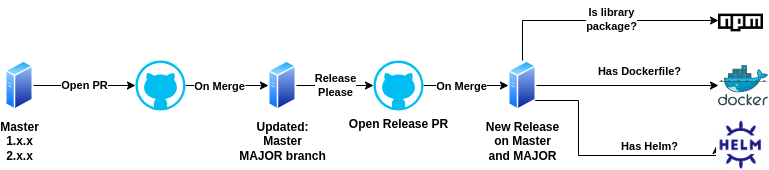
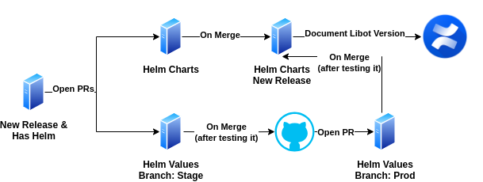

import Tabs from '@theme/Tabs';
import TabItem from '@theme/TabItem';

# Release Management Guide

This document outlines the release management process for Libot Mipuy, which involves multiple teams and services. 
The release strategy follows semantic versioning ([SemVer](https://semver.org/)) for individual services
and "Libot version" for managing deployed Libot stack on networks.

## Libot Version Tag

- The **Libot Version** is assigned based on the `helm-charts` release version.
- This version represents the bundle of all service releases for the deployment to production.

## Service Branching Strategy

Each service must maintain at least one main branch to track the latest stable release and major version updates:

1. **`master`**:
   - Represents the latest stable version of the service.
   - Merges to this branch indicate the most recent production-ready release.
   
2. **`MAJOR.x.x`** (e.g., `1.x.x`, `2.x.x`):
   - Tracks the major version series of a service.
   - A new branch is created for every major version that is smaller than the latest major version.
   - Example:
     - If a service's latest release version is `3.3.0` and a new bug fix needs to be merged to latest release with major version '2', 
       a pull request (PR) will be created for both:
       - `master` (represents 3.x.x) - only if the bug fix relevant to this release too
       - `2.x.x` (to track the new version with the fix).
     - Once merged, both branches will represent a release with the bug fix, while the `1.x.x` branch remains unchanged.

## Service Release Flow

Explanation:

1. The developer creates a PR

2. On merging to master: 
    - release-please takes action and opens a PR release with these changes:
        - Updating package.json to the new release version
        - Updating Changelog with the new version
        - Updating helm (chart version)

    :::info
    The release version will be based on ([SemVer](https://semver.org/)) (according to the PR title)
    :::

3. On merging the release PR to master:
    - release-please will create a new release

4. On new release, an automate workflow will be triggered to:
    - if it is a library repo -> push to NPM
    - if it has Dockerfile -> build a docker image and push to registry
    - if it has helm -> package the helm chart and push to registry

**End State:**
    - New release version based on SemVer
    - master points to the new release
    - NPM, Docker and Helm registries updated with the new release

## Helm Repositories Strategy

The project includes three additional repositories for Helm charts and values:

1. Service Repositories:
    - Each service repository contains its own actual Helm chart.

2. **`helm-charts`**:
    - This repository contains packaged versions of all the Helm charts used across services.
    - The Helm charts themselves are imported from a registry via OCI, meaning the repository
      stores the packaged charts rather than the actual charts.
    - This repository represents the Libot Version during the annual production deployment.

3. **`helm-values`**:
   - Stores Helm values for different environments.
   - Contains branches for each environment (e.g., `stage`, `prod`).

When changes are pushed to `master` in the service repos,  
automatic PRs are created in both `helm-charts` and `helm-values`:
    - Initially, an automatic PR is created in `helm-chart`.
    - Once the PR is merged to master, an automatic stage PR is opened in `helm-values`
    - Once the stage PR is merged, another automatic PR is created for the prod branch, 
      facilitating the promotion of changes to production.
    - Once the prod PR is merged, a new release (represents Libot version) will be created in:
        1. stage branch
        2. prod branch
        3. `helm-charts` repo

When a new release of Libot is created, a workflow is triggered to document the Libot version and all its dependencies in Confluence.

**End State:**
    - New release version of Libot
    - OCP updated in stage and prod namespaces
    - Confluence updated with the Libot version and its dependencies

## Bundle Strategy

You can see more about bundler and unbundler [here](./bundler-unbundler.mdx).  
The only change is that the bundler pipeline will be able to bundle "Libot Version".
