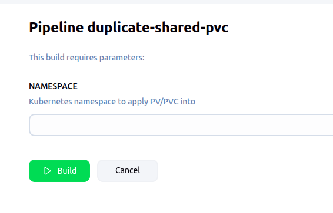

import Tabs from '@theme/Tabs';
import TabItem from '@theme/TabItem';

Why Do I Need This?
Ever needed to access the large, shared ingestion dataset from your development or staging namespace?  
We have a central disk with all this data, but a Kubernetes limitation prevents sharing a single Persistent Volume Claim (PVC) across multiple namespaces.

This Jenkins pipeline is the solution!  
It creates a special "shortcut"—a new Persistent Volume (PV) and PVC—right in your namespace that points directly to the central shared disk.  
It’s a quick and easy way to get read-only access to the data you need without duplicating any files.

You can access the pipeline easily [here](https://jenkins.mapcolonies.net/job/duplicate-shared-pvc/build?delay=0sec)
