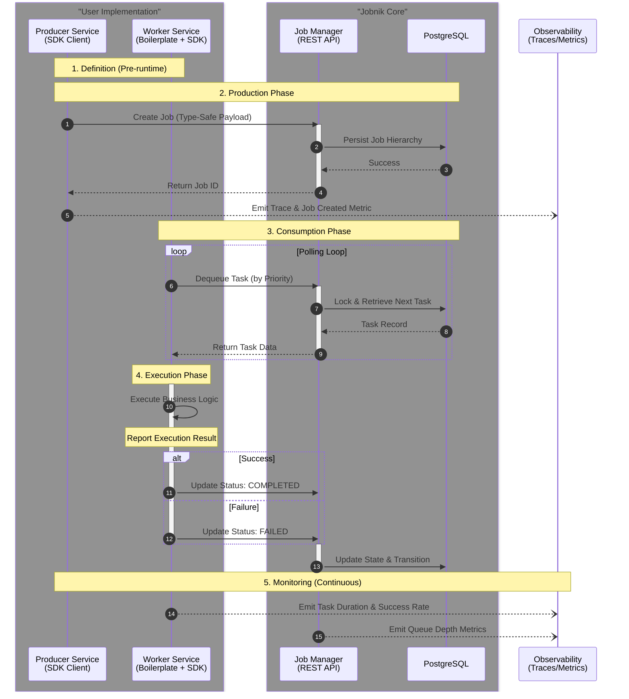

# Jobnik Job Management System Architecture

This document provides a high-level architectural overview of the Jobnik Job Management system. It outlines the primary components, their roles, and how they integrate to facilitate distributed task management and workflow orchestration.

For detailed implementation guides, configuration references, and API documentation, please refer to the specific repositories linked in each section.

## System Overview

Jobnik is a distributed job management ecosystem designed to handle complex, hierarchical workflows. It separates the orchestration logic (state management, queuing, persistence) from the execution logic (task processing), allowing for scalable and resilient distributed systems.

The architecture consists of three main pillars:

1.  **Jobnik Manager:** The central service responsible for state and persistence.
2.  **Jobnik SDK:** The library handling communication, resilience, and type safety.
3.  **Worker Boilerplate:** A standardized scaffolding for building task-processing services.

---

## 1. Job Manager

The Job Manager acts as the central orchestration service and the single source of truth for the system. It exposes a RESTful API that enables external services to create jobs, track progress, and manage task queues.

**Key Responsibilities:**

- **Hierarchical Data Management:** Manages the relationships between **Jobs** (the root entity), **Stages** (logical groupings of tasks), and **Tasks** (atomic units of work).
- **State Management:** Enforces valid state transitions using internal state machines. This prevents invalid operations, such as adding tasks to a completed stage or processing a cancelled job.
- **Persistence:** Stores all workflow data, status history, and operational metadata in a PostgreSQL database.
- **Queue Management:** Implements priority-based task dequeuing logic, ensuring high-priority jobs are processed first.
- **Task Health Management:** Monitors and handles 'forgotten' tasks to ensure no work becomes stale. This includes detecting tasks that have been in-progress for too long and recovering from worker failures.
- **Observability:** Emits standardized metrics (Prometheus) and distributed traces (OpenTelemetry) to monitor system health and request flows.

[Link to Job Manager Repository](https://github.com/MapColonies/jobnik-manager)

---

## 2. Jobnik SDK

The Jobnik SDK is a TypeScript library that abstracts the complexity of communicating with the Job Manager. It provides a typed, resilient communication layer used by both producers (services that create work) and consumers (services that perform work).

**Key Components:**

- **Producer Client:** A client designed for services that initiate workflows. It handles the creation of Jobs, Stages, and Tasks, automatically managing trace context propagation.
- **Worker Client:** A client designed for task processing services. It manages the task lifecycle loop: polling for tasks, executing business logic, and updating task status (Completed/Failed) upon conclusion.

**Core Capabilities:**

- **Type Safety:** Leverages TypeScript Generics to allow developers to define custom schemas for Job, Stage, and Task data. This ensures that payloads passed between Producers and Workers are typed and validated at compile time.
- **Resilience:** Built-in implementation of industry-standard stability patterns, including:
  - **Circuit Breakers:** Prevents cascading failures when the Job Manager is under load.
  - **Exponential Backoff:** Manages retry logic for polling and network requests.
  - **Graceful Shutdown:** Handles signal termination to ensure active tasks are completed or released before the service stops.
- **Automated Observability:** Automatically injects tracing headers into API calls and exposes worker-specific metrics (e.g., active tasks, task duration, success rates) without requiring manual instrumentation in the business logic.

[Link to Jobnik SDK](/docs/knowledge-base/packages/jobnik-sdk/README.md)

---

## 3. Worker Boilerplate

The Worker Boilerplate is a production-ready template repository designed to accelerate the development of new task-processing services. While not a runtime dependency, it serves as the standard starting point for building services that utilize the Jobnik SDK.

**Purpose:**

It provides a pre-configured environment that integrates the Jobnik SDK with standard infrastructure requirements, allowing developers to focus solely on implementing the specific business logic for a task (e.g., image processing, data ingestion).

**Included Scaffolding:**

- **Dependency Injection:** Pre-wired setup using `tsyringe` for managing service dependencies.
- **Configuration Management:** Integration with standard configuration libraries for environment-based settings.
- **SDK Integration:** Example implementation of the SDK's `Worker` client, demonstrating how to register task handlers and define custom types.
- **Deployment Assets:** Includes Dockerfiles and Helm charts aligned with infrastructure standards for rapid deployment.

[Link to Worker Boilerplate Repository](/docs/knowledge-base/jobnik/boilerplate/README.md)

---

## Integration Flow

