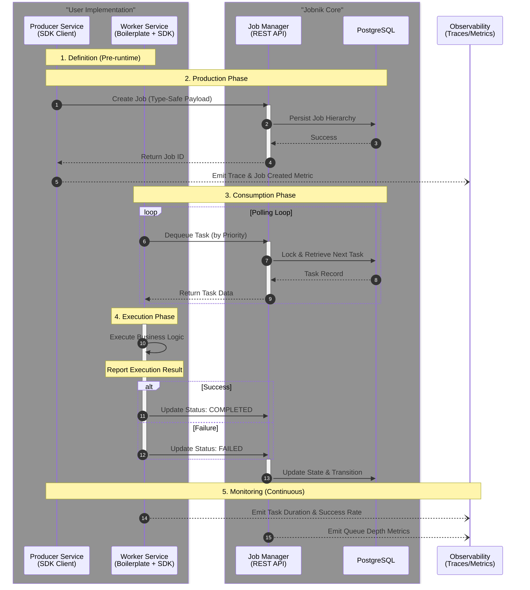

import Tabs from '@theme/Tabs';
import TabItem from '@theme/TabItem';

# 🏭 Jobnik Job Management System

Welcome to the architectural heart of **Jobnik**, our distributed job management ecosystem! 

This document breaks down the primary components, their responsibilities, and how they seamlessly orchestrate complex, hierarchical workflows across our infrastructure. 

*(Need code? Check the specific repositories linked in each section for deep implementation guides, configs, and API docs!)*

## 🌐 System Overview

Jobnik is built to handle massive, complex workflows effortlessly. 

It cleanly separates **orchestration logic** (managing state, queuing, saving data) from **execution logic** (actually doing the heavy lifting). This means highly scalable and resilient distributed systems! 🚀

The architecture stands on three core pillars:
1. 🧠 **Jobnik Manager:** The central brain handling state and persistence.
2. 🔌 **Jobnik SDK:** The robust library handling communication and type safety.
3. 🏗️ **Worker Boilerplate:** The ultimate scaffolding for building new task-processing services.

---

## 1. 🧠 Jobnik Manager

The Jobnik Manager is the ultimate orchestrator and the single source of truth for the entire system. It exposes a clean RESTful API allowing external services to spin up jobs, track progress, and manage task queues.

**What it does:**
* 🗂️ **Hierarchical Data Management:** Manages the complex relationships between **Jobs** (the big picture), **Stages** (logical groups), and **Tasks** (atomic units of work).
* 🚦 **State Management:** Uses strict internal state machines to enforce valid transitions. No more adding tasks to completed stages or processing cancelled jobs!
* 💾 **Persistence:** Safely stores all workflow data, history, and metadata in a rock-solid PostgreSQL database.
* 🚥 **Queue Management:** Smartly dequeues tasks based on priority, guaranteeing the most important jobs jump the line.
* 🏥 **Task Health Management:** Constantly monitors for 'forgotten' tasks, recovering from worker crashes and ensuring no task is ever left behind.
* 🔭 **Observability:** Natively emits Prometheus metrics and OpenTelemetry distributed traces to monitor system health out-of-the-box!

👉 **[Dive into the Job Manager Repository](https://github.com/MapColonies/jobnik-manager)**

---

## 2. 🔌 Jobnik SDK

The Jobnik SDK is our custom TypeScript library that completely abstracts away the headache of talking to the Job Manager. It is the resilient communication layer for both **Producers** (services creating work) and **Consumers/Workers** (services doing work).

**The Core Clients:**
* 📤 **Producer Client:** Creates Jobs, Stages, and Tasks while seamlessly managing trace context propagation.
* 📥 **Worker Client:** Manages the entire task lifecycle loop: polling for work, executing your business logic, and reporting back (Completed/Failed).

**Why you will love it:**
* 🛡️ **Type Safety:** Uses TypeScript Generics! You define custom schemas for your data, guaranteeing payloads are strictly typed and validated at compile time. 
* 🛡️ **Built-in Resilience:** Ships with industry-standard stability:
  * **Circuit Breakers:** Stops cascading failures if the Job Manager is overwhelmed.
  * **Exponential Backoff:** Smart retry logic for network hiccups.
  * **Graceful Shutdown:** Ensures active tasks finish or release cleanly when a pod spins down.
* 📊 **Automated Observability:** Automatically injects tracing headers and exposes golden worker metrics (active tasks, duration, success rates) without you writing a single line of instrumentation code!

👉 **[Explore the Jobnik SDK](/docs/knowledge-base/packages/jobnik-sdk/README.md)**

---

## 3. 🏗️ Worker Boilerplate

Need to build a new task-processing service? Start here! The Worker Boilerplate is a production-ready template repository that slashes setup time.

**What it gives you:**
It perfectly integrates the Jobnik SDK with all our standard infrastructure requirements. You literally just drop in your specific business logic (like image processing or data ingestion) and go! 🚀

**Out-of-the-box Features:**
* 💉 **Dependency Injection:** Pre-wired with `tsyringe`.
* ⚙️ **Config Management:** Fully integrated with our standard environment configuration libraries.
* 🔌 **SDK Integration:** Includes a working example of the SDK's `Worker` client, showing you exactly how to register handlers and define types.
* 🐳 **Deployment Assets:** Comes complete with standard Dockerfiles and Helm charts ready for immediate deployment.

👉 **[Grab the Worker Boilerplate Repository](/docs/knowledge-base/jobnik/boilerplate/README.md)**

---

## 🔄 The Integration Flow

How does it all fit together? Follow the flow from creation to completion!

