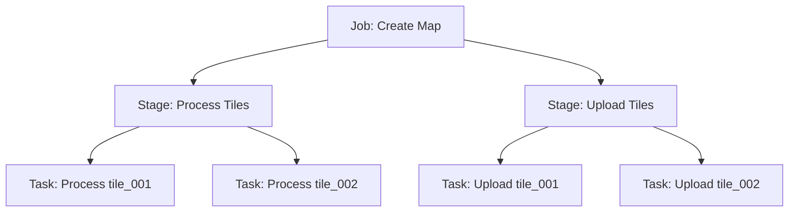

import Tabs from '@theme/Tabs';
import TabItem from '@theme/TabItem';

# Jobnik Concepts & Data Structures

This document covers the core concepts of Jobnik: the three-level hierarchy, the structure of each entity, and how data flows through the system.

For state machine behaviour, see [State Transitions](./state-transitions.mdx).

---

## The Jobnik Hierarchy

Jobnik uses a three-level hierarchy to organise work:

- **Job**: The root entity representing an entire high-level business process (e.g., "Create Map")
- **Stage**: A sequential phase of that process (e.g., "Process Tiles", "Upload Tiles")
- **Task**: An atomic unit of work within a stage (e.g., "Process tile_001")



**Key Concepts:**
- Each Job can have multiple Stages
- **Stages are ordered sequentially** — each stage has an `order` field (1, 2, 3, etc.)
- A stage cannot transition to `PENDING` until the previous stage is `COMPLETED`
- Each Stage can have multiple Tasks
- Tasks within a stage are processed independently and in parallel by Workers
- The Manager enforces all valid state transitions

---

## Job Structure

A **Job** is the root entity that represents an entire workflow.

<Tabs>
<TabItem value="create" label="Creating a Job">

```typescript
const job = await producer.createJob({
  name: 'create-map',              // Job type name
  data: {                          // Business data for the job
    mapId: 'map-123',
    region: 'north',
  },
  userMetadata: {                  // Additional metadata
    requestedBy: 'user-456',
    requestTimestamp: '2026-02-17T10:00:00Z',
  },
  priority: 'HIGH',                // VERY_HIGH | HIGH | MEDIUM | LOW | VERY_LOW
});
```

</TabItem>
<TabItem value="response" label="Job Response">

```typescript
{
  id: 'job-uuid-123',
  name: 'create-map',
  status: 'PENDING',
  data: {
    mapId: 'map-123',
    region: 'north',
  },
  userMetadata: {
    requestedBy: 'user-456',
    requestTimestamp: '2026-02-17T10:00:00Z',
  },
  priority: 'HIGH',
  createdAt: '2026-02-17T10:00:00Z',
  updatedAt: '2026-02-17T10:00:00Z',
}
```

</TabItem>
</Tabs>

**Job Fields:**

| Field | Type | Description |
|-------|------|-------------|
| `id` | `string` | Auto-generated UUID. |
| `name` | `string` | Job type identifier, must match a defined job type. |
| `status` | `enum` | `CREATED` → `PENDING` → `IN_PROGRESS` → `COMPLETED` / `FAILED` / `ABORTED` |
| `data` | `object` | Immutable business payload needed throughout the job lifecycle. |
| `userMetadata` | `object` | Additional context (audit trails, debug info). Not used for task execution. |
| `priority` | `enum` | Determines task dequeue order: `VERY_HIGH`, `HIGH`, `MEDIUM`, `LOW`, `VERY_LOW`. |
| `createdAt` | `string` | ISO 8601 timestamp. Set automatically. |
| `updatedAt` | `string` | ISO 8601 timestamp. Updated on any change. |

---

## Stage Structure

A **Stage** represents a sequential phase within a job. It holds configuration shared across all of its tasks.

:::important Stage Ordering
Stages are **sequentially ordered**. Each stage gets an `order` number (1, 2, 3, …) on creation. A stage can only become `PENDING` once the previous stage is `COMPLETED`.
:::

<Tabs>
<TabItem value="create" label="Creating a Stage">

```typescript
const stage = await producer.createStage(job.id, {
  type: 'process-tiles',           // Stage type name
  data: {                          // Configuration shared by all tasks
    resolution: 'high',
    outputFormat: 'png',
  },
  userMetadata: {                  // Stage-level metadata (mutable during processing)
    processedCount: 0,
  },
});
```

</TabItem>
<TabItem value="response" label="Stage Response">

```typescript
{
  id: 'stage-uuid-456',
  jobId: 'job-uuid-123',
  type: 'process-tiles',
  order: 1,                         // Auto-assigned sequence number
  status: 'IN_PROGRESS',
  data: {
    resolution: 'high',
    outputFormat: 'png',
  },
  userMetadata: {
    processedCount: 35,             // Updated by workers
  },
  summary: {                        // Auto-calculated by system
    pending: 7,
    inProgress: 8,
    completed: 35,
    failed: 0,
    created: 0,
    retried: 0,
    total: 50,
  },
  percentage: 70,                   // floor((35 / 50) * 100)
  startTime: '2026-02-17T10:00:15Z',
  endTime: null,
  createdAt: '2026-02-17T10:00:01Z',
  updatedAt: '2026-02-17T10:05:23Z',
}
```

</TabItem>
</Tabs>

**Stage Fields:**

| Field | Type | Description |
|-------|------|-------------|
| `id` | `string` | Auto-generated UUID. |
| `jobId` | `string` | Parent job reference. |
| `type` | `string` | Stage type identifier. Workers subscribe to specific stage types. |
| `order` | `number` | Auto-assigned execution sequence (1, 2, 3, …). |
| `status` | `enum` | `CREATED` → `PENDING` → `IN_PROGRESS` → `COMPLETED` / `FAILED` / `ABORTED` / `WAITING` |
| `data` | `object` | Immutable configuration shared by all tasks in this stage. |
| `userMetadata` | `object` | Mutable metadata. Can be updated by workers via `context.updateStageUserMetadata()`. |
| `summary` | `object` | Aggregated task counts by status (`pending`, `inProgress`, `completed`, `failed`, `created`, `retried`, `total`). Auto-maintained by the system. |
| `percentage` | `number` | `floor((completed / total) * 100)`. Auto-updated. |
| `startTime` | `string \| null` | When the first task started. `null` until then. |
| `endTime` | `string \| null` | When the stage reached a terminal state. `null` until then. |
| `createdAt` | `string` | ISO 8601 timestamp. Set automatically. |
| `updatedAt` | `string` | ISO 8601 timestamp. Updated on any change. |

---

## Task Structure

A **Task** is an atomic unit of work executed by a worker.

<Tabs>
<TabItem value="create" label="Creating Tasks">

```typescript
await producer.createTasks(stage.id, [
  {
    data: {                        // Task-specific data
      tileId: 'tile-001',
      sourceUrl: 's3://raw/tile-001.tif',
      targetPath: 's3://processed/tile-001.png',
    },
    userMetadata: {
      batchId: 'batch-001',
    },
    maxAttempts: 3,                // Optional, default: 3
  },
]);
```

</TabItem>
<TabItem value="response" label="Task Response">

```typescript
{
  id: 'task-uuid-789',
  stageId: 'stage-uuid-456',
  status: 'PENDING',
  data: {
    tileId: 'tile-001',
    sourceUrl: 's3://raw/tile-001.tif',
    targetPath: 's3://processed/tile-001.png',
  },
  userMetadata: {
    batchId: 'batch-001',
  },
  attempts: 0,
  maxAttempts: 3,
  createdAt: '2026-02-17T10:00:02Z',
  updatedAt: '2026-02-17T10:00:02Z',
}
```

</TabItem>
<TabItem value="worker" label="Task in Worker Context">

```typescript
async function handleTask(
  task: Task<TaskData>,
  context: TaskHandlerContext<JobTypes, StageTypes, 'create-map', 'process-tiles'>
): Promise<void> {
  // Task-level data
  const { tileId, sourceUrl, targetPath } = task.data;

  // Stage-level configuration (shared across all tasks in this stage)
  const { resolution, outputFormat } = context.stage.data;

  // Job-level information
  const { mapId, region } = context.job.data;

  await processTile(sourceUrl, targetPath, { resolution, outputFormat });
}
```

</TabItem>
</Tabs>

**Task Fields:**

| Field | Type | Description |
|-------|------|-------------|
| `id` | `string` | Auto-generated UUID. |
| `stageId` | `string` | Parent stage reference. |
| `status` | `enum` | `CREATED` → `PENDING` → `IN_PROGRESS` → `COMPLETED` / `FAILED` / `RETRIED` / `ABORTED` |
| `data` | `object` | Immutable, task-specific payload. What makes each task unique within a stage. |
| `userMetadata` | `object` | Additional task context. Set at creation, not updatable afterwards. |
| `attempts` | `number` | How many times this task has been attempted. Auto-incremented. |
| `maxAttempts` | `number` | Retry limit. When `attempts >= maxAttempts` and task fails, it transitions to `FAILED`. Default: 3. |
| `createdAt` | `string` | ISO 8601 timestamp. Set automatically. |
| `updatedAt` | `string` | ISO 8601 timestamp. Updated on status change. |

---

## `data` vs `userMetadata`

:::tip Key Distinction
**`data`** is your immutable business payload — the parameters needed to execute the work.  
**`userMetadata`** is mutable helper data — context for tracking, debugging, and monitoring.
:::

| Aspect | `data` | `userMetadata` |
|--------|--------|----------------|
| **Purpose** | Core parameters for task execution | Tracking, audit trails, debug context |
| **Mutability** | **Immutable** after creation | **Mutable** for stages (via `updateStageUserMetadata`) |
| **Example (Job)** | `{ mapId, region }` | `{ requestedBy, requestTimestamp }` |
| **Example (Stage)** | `{ resolution, outputFormat }` | `{ processedCount, failedCount }` |
| **Example (Task)** | `{ tileId, sourceUrl, targetPath }` | `{ batchId, priority }` |

**Use `data` for:** Essential parameters that define *what* the task does — input/output locations, processing settings, business identifiers.

**Use `userMetadata` for:** Non-essential context — who requested it, when, progress counters, audit info, or anything you might want to update as the stage progresses.

---

## See Also

- [State Transitions](./state-transitions.mdx) — understand which status changes are yours to make vs. automatic
- [Architecture Overview](./README.md) — the Manager, SDK, and Worker Boilerplate components
- [Zero to Hero Guide](/docs/guides/jobnik/zero-to-hero.mdx) — put these concepts into practice
