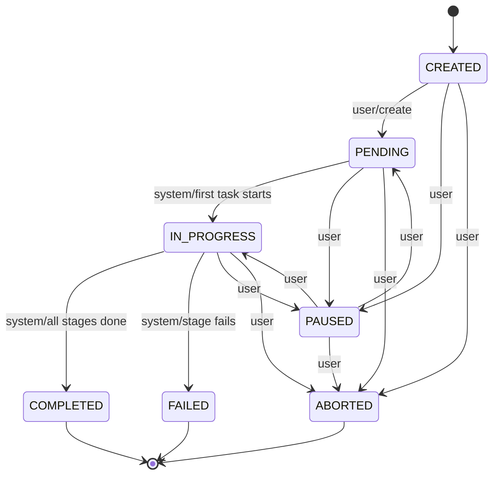
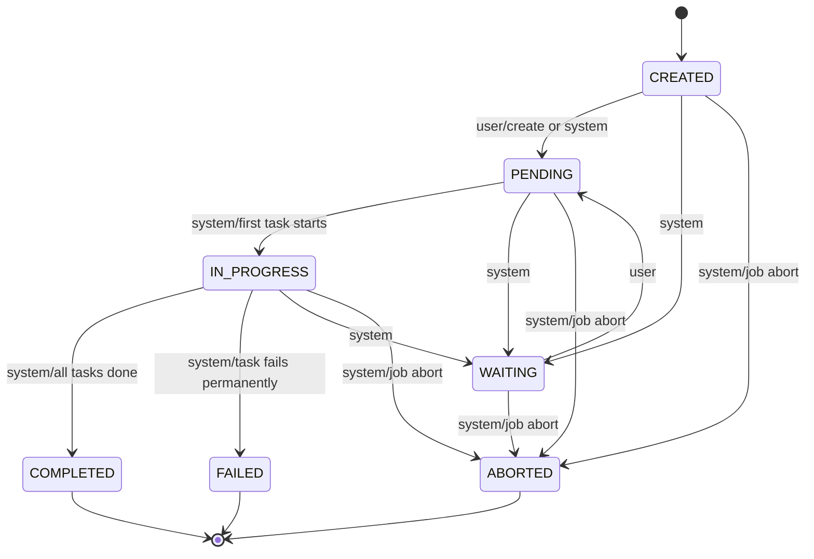
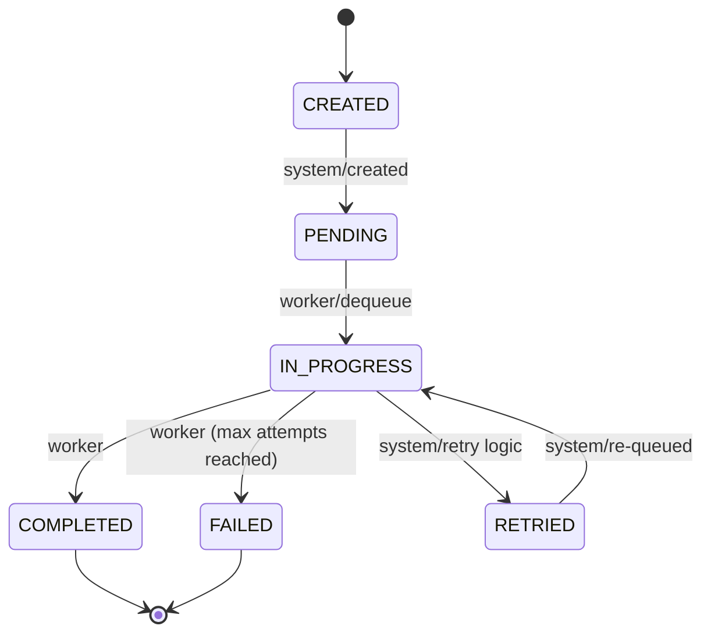

# Jobnik State Transitions

Understanding which state transitions are **user-controlled** (via API) versus **system-controlled** (automatic) is essential for working with Jobnik effectively.

For a description of each entity and its fields, see [Concepts & Data Structures](./concepts.mdx).

---

## Job State Transitions



**User-Controlled (via API):**
- ✅ **PENDING** — Resume a paused job or explicitly start a created job
- ✅ **PAUSED** — Temporarily suspend processing
- ✅ **ABORTED** — Cancel the job permanently

**System-Controlled (automatic):**
- 🤖 **CREATED → PENDING** — Set automatically when the job is created
- 🤖 **PENDING → IN_PROGRESS** — Triggered when the first task in the first stage starts
- 🤖 **IN_PROGRESS → COMPLETED** — Triggered when all stages complete
- 🤖 **IN_PROGRESS → FAILED** — Triggered when a stage fails

```typescript
// Pause a running job
await fetch(`${managerUrl}/v1/jobs/${jobId}/status`, {
  method: 'PUT',
  headers: { 'Content-Type': 'application/json' },
  body: JSON.stringify({ status: 'PAUSED' }),
});

// Resume a paused job
await fetch(`${managerUrl}/v1/jobs/${jobId}/status`, {
  method: 'PUT',
  headers: { 'Content-Type': 'application/json' },
  body: JSON.stringify({ status: 'PENDING' }),
});

// ❌ ILLEGAL: Cannot manually set IN_PROGRESS, COMPLETED, or FAILED
```

---

## Stage State Transitions



**User-Controlled (via API):**
- ✅ **WAITING → PENDING** — Resume a stage waiting for manual approval or intervention

**System-Controlled (automatic):**
- 🤖 **CREATED → PENDING** — Set when the stage is created (if first stage, or previous stage is `COMPLETED`)
- 🤖 **CREATED / PENDING / IN_PROGRESS → WAITING** — System can pause a stage for external conditions
- 🤖 **PENDING → IN_PROGRESS** — Triggered when the first task in the stage starts
- 🤖 **IN_PROGRESS → COMPLETED** — Triggered when all tasks complete successfully
- 🤖 **IN_PROGRESS → FAILED** — Triggered when any task exhausts its retries
- 🤖 **Any → ABORTED** — Cascaded from job abortion

**Stage ordering constraint:** A stage with `order: 2` cannot transition to `PENDING` until the stage with `order: 1` is `COMPLETED`. Sequential execution is strictly enforced.

```typescript
// Resume a stage waiting for manual approval
await fetch(`${managerUrl}/v1/stages/${stageId}/status`, {
  method: 'PUT',
  headers: { 'Content-Type': 'application/json' },
  body: JSON.stringify({ status: 'PENDING' }),
});

// ❌ ILLEGAL: Cannot manually set IN_PROGRESS, COMPLETED, FAILED, or ABORTED
// ❌ ILLEGAL: Cannot set a stage to PENDING if the previous stage is not COMPLETED
```

---

## Task State Transitions



**User-Controlled (via Worker):**
- ✅ **IN_PROGRESS → COMPLETED** — Worker successfully completes the task (return from handler)
- ✅ **IN_PROGRESS → FAILED** — Worker throws an error and max attempts are exhausted

**System-Controlled (automatic):**
- 🤖 **CREATED → PENDING** — Set automatically when the task is created
- 🤖 **PENDING → IN_PROGRESS** — Triggered atomically when a worker dequeues the task
- 🤖 **IN_PROGRESS → RETRIED** — Task failed but `attempts < maxAttempts`; re-queued for retry
- 🤖 **RETRIED → IN_PROGRESS** — Task re-enters the queue for another attempt

```typescript
// The dequeue operation atomically moves PENDING → IN_PROGRESS
// Workers do not need to manage this manually — the SDK handles it

try {
  await processImage(task.data);
  // Returning normally = COMPLETED
} catch (error) {
  throw error; // SDK marks as RETRIED or FAILED depending on attempts
}

// ❌ ILLEGAL: Cannot manually set PENDING or IN_PROGRESS
```

---

## Cascading Effects

State transitions cascade through the hierarchy:

**Task → Stage → Job:**
1. All tasks in a stage complete → stage becomes `COMPLETED`
2. All stages in a job complete → job becomes `COMPLETED`
3. Any task permanently fails → stage becomes `FAILED` → job becomes `FAILED`

**Job abortion cascades down:**
1. User aborts job → job becomes `ABORTED`
2. All stages cascade to `ABORTED`

---

## Summary Table

| Entity | User-Controlled | System-Controlled | API Endpoint |
|--------|----------------|-------------------|--------------|
| **Job** | `PENDING`, `PAUSED`, `ABORTED` | `IN_PROGRESS`, `COMPLETED`, `FAILED`, `CREATED` | `PUT /v1/jobs/{jobId}/status` |
| **Stage** | `PENDING` (from `WAITING` only) | `IN_PROGRESS`, `COMPLETED`, `FAILED`, `ABORTED`, `WAITING`, `CREATED` | `PUT /v1/stages/{stageId}/status` |
| **Task** | `COMPLETED`, `FAILED` | `PENDING`, `IN_PROGRESS`, `RETRIED`, `CREATED` | handled by SDK |

---

## See Also

- [Concepts & Data Structures](./concepts.mdx) — entity fields and the `data` vs `userMetadata` distinction
- [Architecture Overview](.) — the Manager, SDK, and Worker Boilerplate components
- [Zero to Hero Guide](/docs/guides/jobnik/zero-to-hero.mdx) — see state management in a real integration
