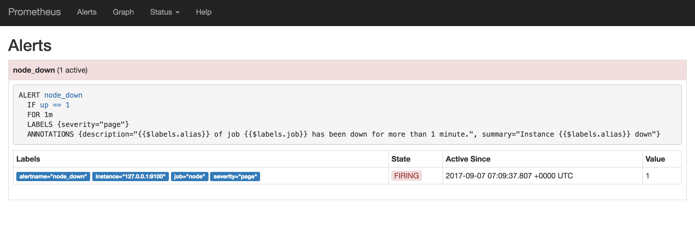

import Tabs from '@theme/Tabs';
import TabItem from '@theme/TabItem';


# Alertmanager
You can access Alertmanager at https://alertmanager.mapcolonies.net


Alertmanager is responsible for handling alerts generated by Prometheus. It manages alert routing, grouping, and sending notifications to various channels such as Slack, email, or other messaging platforms. Alertmanager allows you to manage alert notifications effectively by reducing alert noise and ensuring that the right teams are notified.



## Configure

To route alerts to the correct team, you need to configure Alertmanager with your routing preferences. Here's an example of how to configure an alert route:

```yaml
{
route:
  group_by: ['alertname', 'severity']
  routes:
    - match:
        severity: critical
      receiver: 'critical-notifications'
    - match:
        severity: warning
      receiver: 'slack-notifications'

receivers:
  - name: 'critical-notifications'
    email_configs:
      - to: 'oncall-team@example.com'
        send_resolved: true
  - name: 'slack-notifications'
    slack_configs:
      - channel: '#alerts'
        send_resolved: true
}
```
