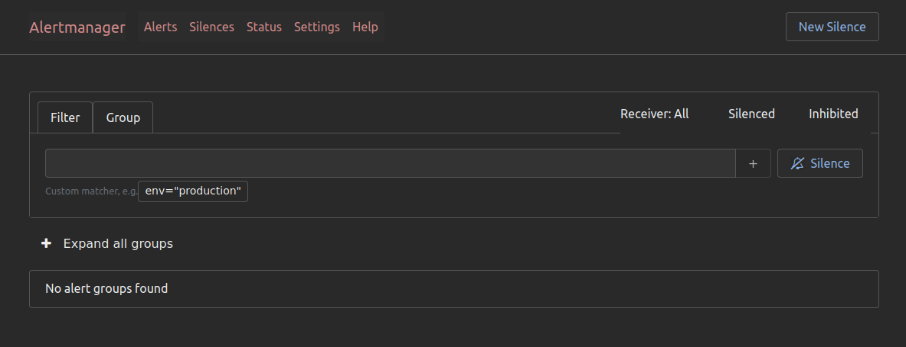

---
id: Alertmanager
title: Alertmanager
sidebar_position: 4
toc_min_heading_level: 2
toc_max_heading_level: 5
---

import Tabs from '@theme/Tabs';
import TabItem from '@theme/TabItem';

# Alertmanager

## Overview
Alertmanager is responsible for handling and routing alerts generated by Prometheus. It manages alert notifications by grouping, routing, and sending alerts to channels such as Slack, email, or other messaging platforms. This helps reduce alert noise and ensures that the correct teams are notified. 

:::tip
You can read more about Alertmanager in the [Alertmanager documentation](https://prometheus.io/docs/alerting/latest/alertmanager/)
:::

## Home Screen Overview
You can access Libot's Alertmanager at the [Alertmanager documentation](https://alertmanager.mapcolonies.net).

The Alertmanager home screen provides an overview of active alerts, alert groups, and their status. You can see how alerts are routed, which notifications are being sent, and to whom. 



## Alert Routing

Alertmanager allows you to define routes that determine where alerts should be sent based on labels like alert severity or environment.

Here’s an example configuration for routing alerts to a Slack channel:

```yaml
route:
  group_by: ['alertname', 'severity']
  group_wait: 30s
  group_interval: 5m
  repeat_interval: 1h
  receiver: 'slack-notifications'

receivers:
  - name: 'slack-notifications'
    slack_configs:
      - channel: '#alerts'
        send_resolved: true
        title: "[{{ .Status | toUpper }}] {{ .CommonLabels.alertname }}"
        text: >
          {{ range .Alerts }} 
          *Alert:* {{ .Annotations.summary }}
          *Description:* {{ .Annotations.description }}
          *Severity:* `{{ .Labels.severity }}`
          {{ end }}
```

This configuration groups alerts by `alertname` and `severity`, waits 30 seconds before sending grouped alerts, and repeats them if unresolved. The alerts are routed to a Slack channel named `#alerts`.

## Managing Alerts

Alerts can be managed in the Alertmanager UI, where you can silence, group, and view the history of all alerts. Here's an example of an active alert in the system:


## Conclusion

Alertmanager is crucial in ensuring the right people are notified in the right way, reducing noise and keeping alerts manageable. With routing and grouping options, you can finely tune how your team receives and handles critical issues.
