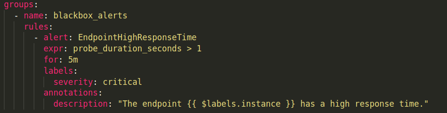

import Tabs from '@theme/Tabs';
import TabItem from '@theme/TabItem';


# BlackBox Exporter
The Blackbox Exporter is a probing tool used to monitor the availability of external endpoints, such as websites or services. It works by sending requests to endpoints and collecting data on their availability, response time, and status codes, which are then scraped by Prometheus. The data collected by the Blackbox Exporter can be visualized in Grafana using panels to show uptime, response times, and more.

## Scrape Setup
To scrape your endpoint, you need to create an entry in this section of the `prometheus.yml` configuration:

```yaml
extraScrapeConfigs: |
  - job_name: 'blackbox'
    metrics_path: /probe
    scrape_interval: 15s
    params:
      module: [http_2xx]  # Look for an HTTP 200 response.
    static_configs:
      - targets:
          - https://your-endpoint.com
          - https://another-endpoint.com

```
## Alerting
You can set up alert rules in Prometheus based on Blackbox Exporter metrics.  
Here’s an example of an alert rule that checks for high response times:

