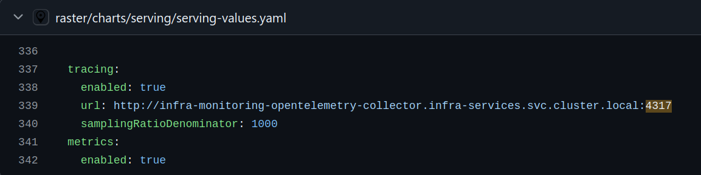

import Tabs from '@theme/Tabs';
import TabItem from '@theme/TabItem';

# OpenTelemetry Collector

The OpenTelemetry Collector is responsible for gathering, processing, and exporting telemetry data, including traces, metrics, and logs. It receives telemetry data from your services, processes it, and sends it to backends for storage and visualization. The OpenTelemetry acts as a bridge between your services and observability backends like Grafana Tempo for traces and Prometheus for metrics.

## Example: Collecting Traces

To collect distributed traces from your services and send them to Grafana Tempo for visualization, you need to configure the OpenTelemetry Collector to receive and export traces. Here’s an example configuration:

