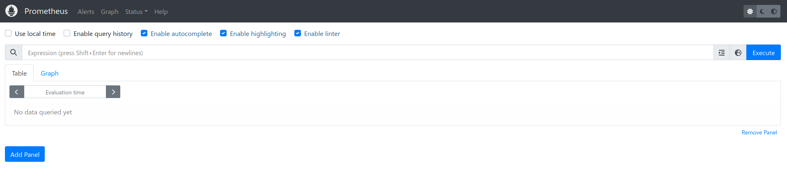
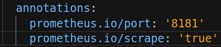
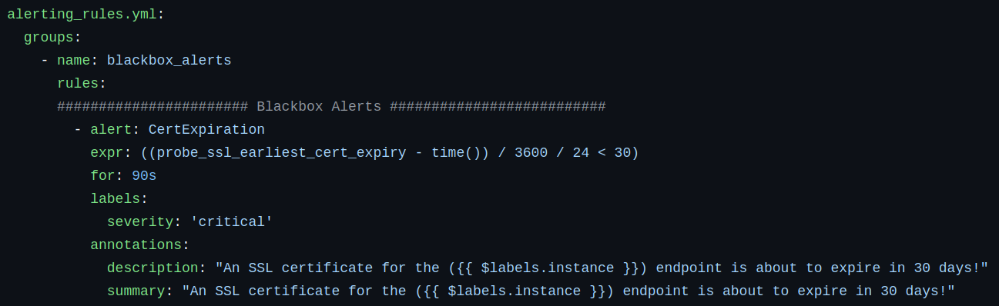

import Tabs from '@theme/Tabs';
import TabItem from '@theme/TabItem';


# Prometheus
You can access Prometheus at https://prometheus.mapcolonies.net.

Prometheus is the core system for **collecting and storing metrics** as time-series data, meaning each metric is stored with the timestamp of when it was recorded, alongside labels that provide additional context to the metric.

## Home Screen Overview 
The Prometheus home screen provides an overview of the current status of the Prometheus server. Here, you can see the targets that are being monitored, the current configuration of Prometheus, and access the built-in query interface.


## Prometheus Scrape Configuration
Prometheus scrapes metrics from pods located in specific namespaces and annotated correctly. Below is an example configuration snippet:

  ```yaml
  {
    - job_name: k8s-scrape
    kubernetes_sd_configs:
      - role: pod
        namespaces:
          own_namespace: true
          names:
            - projectA
            - projectB
    relabel_configs:
      - source_labels: [__meta_kubernetes_pod_annotation_prometheus_io_scrape]
        action: keep
        regex: true
  }
  ```
To ensure your pod is scraped, it should be deployed in one of the listed namespaces and annotated correctly. The required annotation looks like this:



## Prometheus Alerts
Prometheus allows you to define alert rules that trigger when certain conditions are met. 


These alert rules are defined in Prometheus' configuration and are automatically evaluated.

