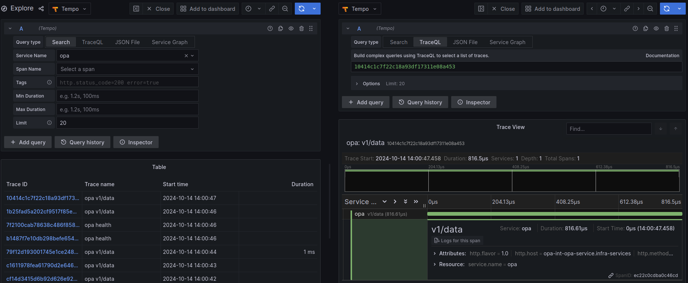

import Tabs from '@theme/Tabs';
import TabItem from '@theme/TabItem';

# Grafana Tempo

You can access Grafana Tempo at https://grafana.mapcolonies.net/datasources/edit/tempo.

Grafana Tempo is a distributed tracing backend used to store and query trace data received from OpenTelemetry Collector or other tracing sources like Jaeger. It allows you to analyze traces for system performance, error detection, and latency tracking. Tempois capable of storing trace data at high throughput without requiring an index, making it highly efficient for large-scale applications.

## Example: Visualizing Traces
Once the OpenTelemetry Collector sends traces to Tempo, you can view and analyze these traces in Grafana.

