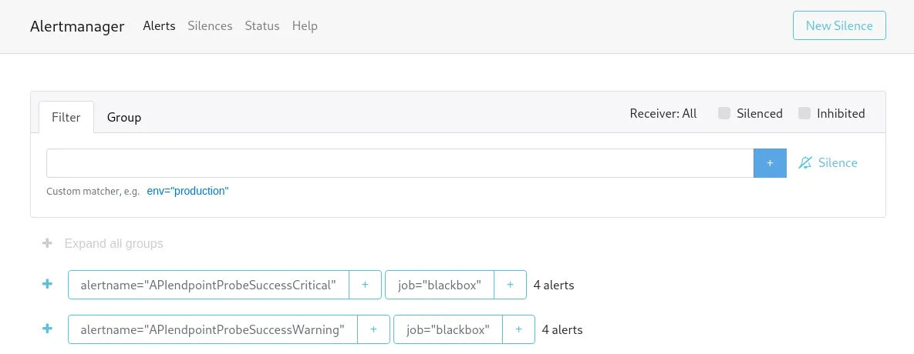

import Tabs from '@theme/Tabs';
import TabItem from '@theme/TabItem';

# Alertmanager

## Overview
Alertmanager is responsible for handling and routing alerts generated by Prometheus.
It manages alert notifications by grouping, routing, and sending alerts to channels such as Slack, email,
or other messaging platforms. This helps reduce alert noise and ensures that the correct teams are notified. 

The system supports alerts categorized by:
- **Severity**: Critical, Warning, and Info levels.
- **Environment**: Alerts can be tagged with `production`, `staging`, or `development` to indicate the context.
- **Service Labels**: Alerts often include labels like `service` and `team` to provide clarity on the affected component.

:::tip
You can read more about Alertmanager in the [Alertmanager documentation](https://prometheus.io/docs/alerting/latest/alertmanager/)
:::

## Home Screen Overview
You can access Libot's Alertmanager at the [MapColonies Alertmanager](https://alertmanager.mapcolonies.net).

The Alertmanager home screen provides an overview of active alerts, alert groups, and their status.
You can see how alerts are routed, which notifications are being sent, and to whom. 

## Alert Routing

Alertmanager enables you to define routes that determine where alerts should be sent, based on labels such
as alert severity or environment. It supports routing alerts to various platforms, including Slack,
classified chat systems, and email.

:::note
The routing configuration is global and centrally managed by the **infra team**. Users do not need to configure routing themselves. If you have specific requirements or changes, contact the infra team to discuss adjustments to the global configuration.
:::

## Managing Alerts

Alerts can be managed in the Alertmanager UI, where you can silence, group, and view the history of all alerts.
Here's an example of an active alert in the system:

## Conclusion

Alertmanager is crucial in ensuring the right people are notified in the right way, reducing noise and keeping alerts
manageable. With routing and grouping options, you can finely tune how your team receives and handles critical issues.
