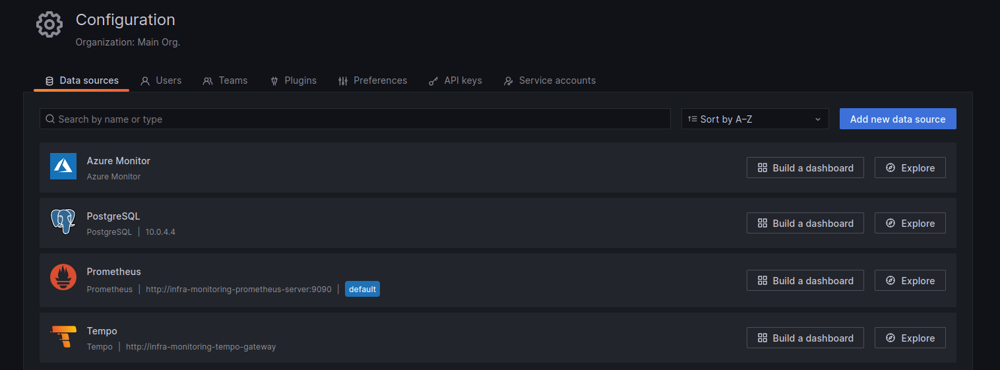

import Tabs from '@theme/Tabs';
import TabItem from '@theme/TabItem';

# Grafana

You can access Grafana at https://grafana.mapcolonies.net.

Grafana is a visualization tool that allows you to query, visualize, and analyze metrics from multiple data sources,
such as Prometheus, as well as trace data from Tempo.

Grafana enables you to create and customize powerful dashboards that give insights into system performance,
resource usage, and alerting metrics.

In addition to visualizations, Grafana is also integrated with alerting capabilities, allowing you to trigger alerts
when certain conditions are met in your metrics data.
