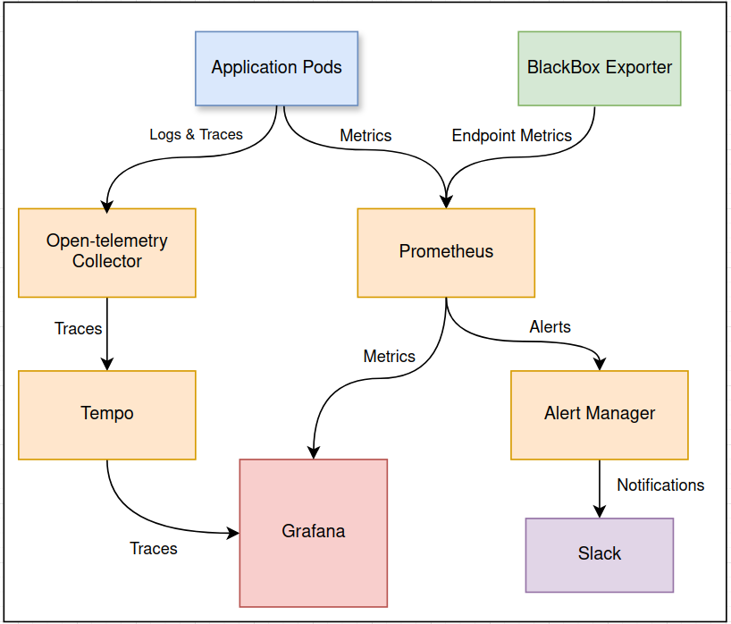

import Tabs from '@theme/Tabs';
import TabItem from '@theme/TabItem';

# An Overview of Monitoring Stack

The monitoring stack is a Kubernetes-based stack used to observe, monitor, and alert on the health and performance metrics. It leverages open-source tools, including **Prometheus**, **Grafana**, **Blackbox Exporter**, **Alertmanager**, and **OpenTelemetry**.



# Prometheus
You can access Prometheus at https://prometheus.mapcolonies.net.

Prometheus is the core system for collecting and storing metrics as time-series data, meaning each metric is stored with the timestamp of when it was recorded, alongside labels that provide additional context to the metric.

Metrics are collected at intervals of 5 seconds with a timeout of 3 seconds. Evaluation of rules (for alerting, recording, etc.) happens every 30 seconds.

```yaml
{
  global:
      scrape_interval: 5s
      scrape_timeout: 3s
      evaluation_interval: 30s
}
```

Our Prometheus instance scraping configuration is defined in prometheus.yml and is set to scrape metrics from multiple sources:

1. It scrapes its own metrics to monitor its performance.
  ```yaml
  {
    prometheus.yml:
      scrape_configs:
        - job_name: prometheus
          static_configs:
            - targets:
              - localhost:9090
  }
  ```

2. It scrapes other pods that are in specific namespaces and correctly labeled.
  ```yaml
  {
        - job_name: k8s-scrape
          kubernetes_sd_configs:
            - role: pod
              namespaces:
                own_namespace: true
                names:
                  - projectA
                  - projectB
          relabel_configs:
            - source_labels: [__meta_kubernetes_pod_annotation_prometheus_io_scrape]
              action: keep
              regex: true
  }
  ```

3. It scrapes endpoints using the Blackbox Exporter for external probing.
  ```yaml
  {
    extraScrapeConfigs: |
      - job_name: 'blackbox'
        metrics_path: /probe
        scrape_interval: 15s
        params:
          module: [http_2xx]  # Look for a HTTP 200 response.
        static_configs:
          - targets:
            - https://service-a  # Target to probe with http.
            - https://service-b
  }
  ```

Prometheus is tightly integrated with Alertmanager for handling alerts. Alerts are triggered based on predefined rules specified in the alerting_rules.yml file.

```yaml
{
serverFiles:
  alerting_rules.yml:
    groups:
      - name: group_a_alerts
        rules:
          - alert: HighExampleMetricValue
            expr: (example_metric_value > 10)
            for: 90s
            labels:
              severity: 'critical'
            annotations:
              description: "The example metric value is too high."
}
```

# BlackBox Exporter
The Blackbox Exporter probes specified endpoints by sending them requestes and reports back the results, such as the HTTP status code, response time, or SSL certificate information. These metrics are scraped by Prometheus and can be visualized in Grafana dashboards or used for alerting through Alertmanager.

The configuration for Blackbox scraping is defined in the `prometheus.yml` file under the `extraScrapeConfigs` section:
```yaml
extraScrapeConfigs: |
  - job_name: 'blackbox'
    metrics_path: /probe
    scrape_interval: 15s
    params:
      module: [http_2xx]  # Look for an HTTP 200 response.
    static_configs:
      - targets:
        - https://service-a  # Target to probe with http.
        - https://service-b
    relabel_configs:
      - source_labels: [__address__]
        target_label: __param_target
      - source_labels: [__param_target]
        target_label: instance
      - target_label: __address__
        replacement: blackbox-exporter:9115
```

# Alertmanager
You can access Alertmanager at https://alertmanager.mapcolonies.net

Alertmanager receives alerts from Prometheus when conditions specified in Prometheus' `alerting_rules.yml` file are triggered. 
Alerts can be grouped by labels (e.g., `alertname`, `job`, `severity`) and routed to different receivers like Slack or other notification services. It also supports silencing and inhibiting alerts to reduce noise during maintenance or related incidents.

```yaml
{
route:
  group_by: ['alertname', 'severity']
  routes:
    - match:
        severity: critical
      receiver: 'critical-notifications'
    - match:
        severity: warning
      receiver: 'slack-notifications'

receivers:
  - name: 'critical-notifications'
    email_configs:
      - to: 'oncall-team@example.com'
        send_resolved: true
  - name: 'slack-notifications'
    slack_configs:
      - channel: '#alerts'
        send_resolved: true
}
```


# Grafana

You can access Grafana at https://grafana.mapcolonies.net.

Grafana is a visualization tool that allows you to query, visualize, and analyze metrics from multiple data sources, such as Prometheus, as well as trace data from Tempo.
```yaml
  datasources:
    datasources.yaml:
      apiVersion: 1
      datasources:
        - name: Prometheus
          uid: prometheus
          type: prometheus
          url: 'http://infra-monitoring-prometheus-server:9090'
          editable: true
          isDefault: true
        - name: Tempo
          uid: tempo
          type: tempo
          url: 'http://infra-monitoring-tempo-gateway'
          editable: true
          isDefault: false
```

Grafana enables you to create customizable and use powerful dashboards that give insights into system performance, resource usage, and alerting metrics.
In addition to visualizations, Grafana is also integrated with alerting capabilities, allowing you to trigger alerts when certain conditions are met in your metrics data.

# OpenTelemetry Collector

The OpenTelemetry Collector collects, processes, and exports telemetry data such as traces, logs, and metrics. It connects your services to observability backends like Grafana Tempo (for traces) and Prometheus (for metrics).


OTEL receivers define where telemetry data comes from.
```yaml
receivers:
  otlp:
    protocols:
      grpc:
        endpoint: ${env:MY_POD_IP}:4317
      http:
        endpoint: ${env:MY_POD_IP}:4318
        cors:
          allowed_origins:
            - "http://*"
            - "https://*"
```

OTEL processors manage and optimize telemetry data flow by limiting memory usage, batching data, and sampling traces.
```yaml
processors:
  probabilistic_sampler:
    sampling_percentage: 15
  memory_limiter:
  batch:
```

OTEL exporters define where the processed telemetry data is sent. Here, we export traces to Grafana Tempo and log data for debugging.
```yaml
exporters:
  otlphttp:
    endpoint: http://infra-monitoring-tempo-gateway
    tls:
      insecure: true
  logging: {}
```

# Grafana Tempo

You can access Grafana Tempo at https://grafana.mapcolonies.net/datasources/edit/tempo.

Grafana Tempo is a distributed tracing backend used to store and query trace data received from OpenTelemetry Collector or other tracing sources like Jaeger. It allows you to analyze traces for system performance, error detection, and latency tracking. Tempois capable of storing trace data at high throughput without requiring an index, making it highly efficient for large-scale applications.

Grafana Tempo has several compnents:
- **Distributor**: Receives traces and forwards them to the ingesters.
- **Ingester**: Writes trace data to the storage backend.
- **Compactor**: Compacts and deduplicates trace data to optimize storage.
- **Querier**: Processes user queries from Grafana and retrieves traces.
- **Query Frontend**: Batches and coordinates trace queries, reducing the load on queriers.

