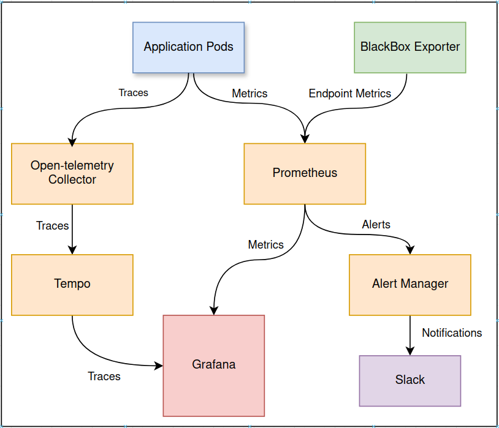
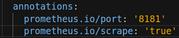

import Tabs from '@theme/Tabs';
import TabItem from '@theme/TabItem';

# An Overview of Monitoring Stack

The monitoring stack is a Kubernetes-based stack used to observe, monitor, and alert on the health and performance metrics.
It leverages open-source tools, including **Prometheus**, **Grafana**, **Blackbox Exporter**, **Alertmanager**, and **OpenTelemetry**.



## Prometheus
You can access Prometheus at https://prometheus.mapcolonies.net.

Prometheus is the core system for **collecting and storing metrics** as time-series data, meaning each metric is stored with the timestamp of when it was recorded, alongside labels that provide additional context to the metric.

### Home Screen Overview 
The Prometheus home screen provides an overview of the current status of the Prometheus server. Here, you can see the targets that are being monitored, the current configuration of Prometheus, and access the built-in query interface.


### Prometheus Scrape Configuration
Prometheus scrapes metrics from pods located in specific namespaces and annotated correctly. Below is an example configuration snippet:

  ```yaml
  {
    - job_name: k8s-scrape
    kubernetes_sd_configs:
      - role: pod
        namespaces:
          own_namespace: true
          names:
            - projectA
            - projectB
    relabel_configs:
      - source_labels: [__meta_kubernetes_pod_annotation_prometheus_io_scrape]
        action: keep
        regex: true
  }
  ```
To ensure your pod is scraped, it should be deployed in one of the listed namespaces and annotated correctly. The required annotation looks like this:



### Prometheus Alerts
Prometheus allows you to define alert rules that trigger when certain conditions are met. 


These alert rules are defined in Prometheus' configuration and are automatically evaluated.


## BlackBox Exporter
The Blackbox Exporter is a probing tool used to monitor the availability of external endpoints, such as websites or services. It works by sending requests to endpoints and collecting data on their availability, response time, and status codes, which are then scraped by Prometheus. The data collected by the Blackbox Exporter can be visualized in Grafana using panels to show uptime, response times, and more.

### Scrape Setup
To scrape your endpoint, you need to create an entry in this section of the `prometheus.yml` configuration:

```yaml
extraScrapeConfigs: |
  - job_name: 'blackbox'
    metrics_path: /probe
    scrape_interval: 15s
    params:
      module: [http_2xx]  # Look for an HTTP 200 response.
    static_configs:
      - targets:
          - https://your-endpoint.com
          - https://another-endpoint.com

```
### Alerting
You can set up alert rules in Prometheus based on Blackbox Exporter metrics.  
Here’s an example of an alert rule that checks for high response times:


## Alertmanager
You can access Alertmanager at https://alertmanager.mapcolonies.net


Alertmanager is responsible for handling alerts generated by Prometheus. It manages alert routing, grouping, and sending notifications to various channels such as Slack, email, or other messaging platforms. Alertmanager allows you to manage alert notifications effectively by reducing alert noise and ensuring that the right teams are notified.


### Configure

To route alerts to the correct team, you need to configure Alertmanager with your routing preferences. Here's an example of how to configure an alert route:

```yaml
{
route:
  group_by: ['alertname', 'severity']
  routes:
    - match:
        severity: critical
      receiver: 'critical-notifications'
    - match:
        severity: warning
      receiver: 'slack-notifications'

receivers:
  - name: 'critical-notifications'
    email_configs:
      - to: 'oncall-team@example.com'
        send_resolved: true
  - name: 'slack-notifications'
    slack_configs:
      - channel: '#alerts'
        send_resolved: true
}
```


## Grafana

You can access Grafana at https://grafana.mapcolonies.net.

Grafana is a visualization tool that allows you to query, visualize, and analyze metrics from multiple data sources, such as Prometheus, as well as trace data from Tempo.


Grafana enables you to create customizable and use powerful dashboards that give insights into system performance, resource usage, and alerting metrics.


In addition to visualizations, Grafana is also integrated with alerting capabilities, allowing you to trigger alerts when certain conditions are met in your metrics data.

## OpenTelemetry Collector

The OpenTelemetry Collector is responsible for gathering, processing, and exporting telemetry data, including traces, metrics, and logs. It receives telemetry data from your services, processes it, and sends it to backends for storage and visualization. The OpenTelemetry acts as a bridge between your services and observability backends like Grafana Tempo for traces and Prometheus for metrics.

### Example: Collecting Traces

To collect distributed traces from your services and send them to Grafana Tempo for visualization, you need to configure the OpenTelemetry Collector to receive and export traces. Here’s an example configuration:


## Grafana Tempo

You can access Grafana Tempo at https://grafana.mapcolonies.net/datasources/edit/tempo.

Grafana Tempo is a distributed tracing backend used to store and query trace data received from OpenTelemetry Collector or other tracing sources like Jaeger. It allows you to analyze traces for system performance, error detection, and latency tracking. Tempois capable of storing trace data at high throughput without requiring an index, making it highly efficient for large-scale applications.

### Example: Visualizing Traces
Once the OpenTelemetry Collector sends traces to Tempo, you can view and analyze these traces in Grafana.

