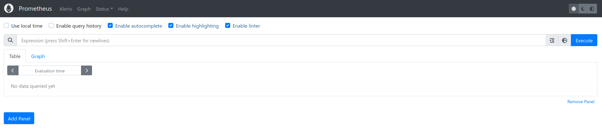
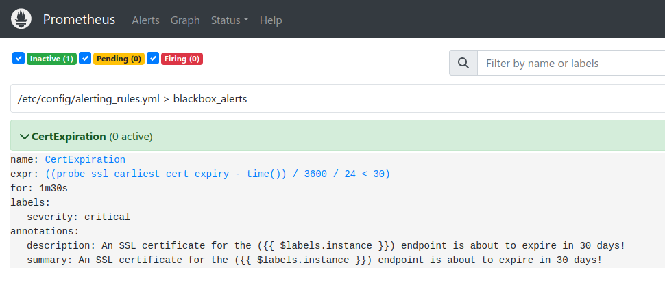

import Tabs from '@theme/Tabs';
import TabItem from '@theme/TabItem';


# Prometheus

## Overview
Prometheus is an open-source monitoring and alerting system designed to collect and store metrics as time series data.
It scrapes metrics from targets like applications pods and servers, stores them with the timestamp and labels
and allows querying using PromQL. Prometheus is commonly used to track system performance and set up alerts based on defined
conditions.


:::tip
You can read more about Prometheus in the [Prometheus documentation](https://prometheus.io/docs/introduction/overview/)
:::

## Home Screen Overview 
You can access Libot's Prometheus at https://prometheus.mapcolonies.net.

The Prometheus home screen provides an overview of the current status of the Prometheus server.
Here, you can see the targets that are being monitored, the current configuration of Prometheus,
and access the built-in query interface.



## Prometheus Scrape Configuration
Prometheus scrapes metrics from pods located in specific namespaces and annotated correctly.

### Configuring Your Service for Prometheus Scraping

To ensure your pod is scraped, it should be deployed in one of the listed namespaces and annotated correctly.
The required annotation looks like this:

```yaml
  podAnnotations:
    prometheus.io/scrape: "true"
    prometheus.io/port: "10000"
```

## Prometheus Alerts

:::tip
You can access the official [Prometheus alerting documentation](https://prometheus.io/docs/prometheus/latest/configuration/alerting_rules/) 
:::

Prometheus Alerts are rules defined in Prometheus that automatically trigger notifications when certain conditions are met,
such as high CPU usage or service downtime.



These alert rules are defined in Prometheus' configuration and are automatically evaluated.

```yaml title="Alerts Config"
alerting_rules.yml:
  groups:
    - name: blackbox_alerts
      rules:
        - alert: CertExpiration
          expr: ((probe_ssl_earliest_cert_expiry{job="blackbox"} - time()) / 3600 / 24 < 30)
          for: 90s
          labels:
            severity: 'critical'
          annotations:
            description: "A certificate ({{ $labels.instance }}) is about to expire in 30 days!"
            summary: "A certificate ({{ $labels.instance }}) is about to expire in 30 days!"
```

:::info Key Fields in Prometheus Alert Configuration

- **groups**: Organizes alerts into logical groups. Alerts within the same group are evaluated together.
- **alert**: The name of the alert, which should describe the issue it triggers.
- **expr**: The PromQL expression that defines when the alert should be triggered.
If the expression evaluates as true, the alert fires.
- **for**: The amount of time the condition must be met before triggering the alert.
- **labels**: Additional labels that provide context or are used for routing in Alertmanager.
- **annotations**: Human-readable descriptions or summaries of the alert.

:::

To add, update, or remove an alert, you need to create a pull request in the repository
[here](https://github.com/MapColonies/helm-charts/blob/master/infra/monitoring/values/alerts-values.yaml).  
After that, please notify the infra team for a review and upgrade.
