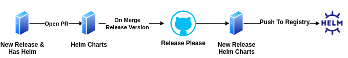
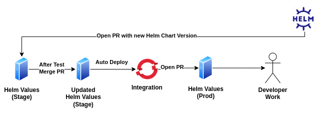

import Tabs from "@theme/Tabs";
import TabItem from "@theme/TabItem";

# Release Management Guide

This document outlines the release management process for Libot Mipuy, which involves multiple teams and services.
The release strategy follows semantic versioning ([SemVer](https://semver.org/)) for individual services
and the "Libot version" which is used for managing our deployment stack in different networks.

## Libot Version

The **Libot Version** is an alias to specific versions of various domains within the `helm-charts` repository 
(which serves as our "one source of truth" for the structure of helm, as explained below in [Helming Strategy](#helming-strategy)). 

This means that it encompasses the entirety of all service releases for the production deployment and its structure.

## Service Branching Strategy

Each service must maintain at least one main branch to track the latest stable release and major version updates:

1. **`master`**:
   - Represents the latest stable version of the service.
   - Merges to this branch indicate the most recent production-ready release.
2. **`MAJOR.x.x`** (e.g., `1.x.x`, `2.x.x`):
   - Tracks the major version series of a service.
   - A new branch is created for every major version that is smaller than the latest major version.
   - Example:
     - If a service's latest release version is `3.3.0` and a new bug fix needs to be merged to latest release with major version '2',
       a pull request (PR) will be created for both:
       - `master` (represents 3.x.x) - only if the bug fix relevant to this release too
       - `2.x.x` (to track the new version with the fix).
     - Once merged, both branches will represent a release with the bug fix, while the `1.x.x` branch remains unchanged.

## Service Release Flow

Explanation:

1. The developer creates a PR

2. On merging to master `release-please` takes action and opens a release PR with these changes:

   - Updating all relevant files with the new release version
   - Updating Changelog with the new version details
   - Updating helm (chart version)

   :::info
   The release version will be based on [SemVer](https://semver.org/) (according to the PR title that will abide
   [commitlint](https://github.com/conventional-changelog/commitlint))
   :::

3. On merging the release PR to master, `release-please` will create a new release

4. On new release, some automate workflows will be triggered (concurrently):
   - Push to `NPM` (for libraries)
   - Build a docker image and push to registry (if a `Dockerfile` exists)
   - Pack the helm chart and push to registry (if a `helm` chart exists)

**End State:** - New release version based on `SemVer` - new release points to `master` - New release is pushed to `npm`, `docker` and `helm` registries

:::info
The deployment flow is described in the next section
:::

## Helming Strategy

:::warning
This strategy does not include the checks you should make during the development process such as running tests which should occur before the release.
We assume that the new released service is properly checked and its updated chart is properly constructed.
:::

The project includes two different repositories that represent two different flows:

1. **Chart Flow using "Helm-Charts" repo** - Handling the structure of the libot charts. The structure will be similar to [bitnami](https://github.com/bitnami/charts/tree/main/bitnami), like this:

**Every chart is a standalone chart.**  
In this example, you can see every chart of raster, like: "raster-core" and "raster-ingestion" and a chart of whole raster
that should deploy the entire domain (this chart can contain the other charts of raster as sub-dependencies).

2. **Values Flow using "Helm-Values" repo** - Handling the deployment in openshift based on the new charts that was created in `helm-charts`

### Explanation

The main goal is to separate the development part in `helm-charts` (the structure) from the deployment part in `helm-values` (the values).

`helm-charts` repo will contain only the charts, which is the deployment structure, and a default `values` file.
The structure shouldn't change much from now on (for the current set of features).  
`helm-values` repo will contain **only the values based on the relevant chart**
and the `helm-chart` version it's based on (a file named "charts-version.txt" in the repo).
The value files that represent openshift namespaces should not be part of the structure
(as they are only config files), they should be in a different repo.

This gives us the following benefits:

1. **Avoiding "irrelevant" commits**  
   Imagine if we keep the values with the chart. If we want to change the log level, for example, from `info` to `debug`,
   we will have to commit the change as part of the chart. This is true for all changes made to any value.
   This means we will clutter the repo with a lot of commits that don't have anything to do with the core of the chart itself.

2. **Informative versions for helm-charts**  
   If we keep the chart and the values together, we will have a hard time properly handling the release of helm-chart due to
   the many changes to the values (which aren't part of a release).
   On the other hand, there are some value changes that are more meaningful that we want to document.
   For example, you want to change the default port to be 80, This is a "structure" change because you want to set a new default value.
   If you keep the values as part of the chart, you won't know what requires a new release and what doesn't.
   When they are separated, it is clearer what changes are a core part of your chart.

3. **One true structure**  
   Currently, the charts in the different networks are different from the charts in Azure because they can be modified.
   Using the new strategy, we make sure that there will be one source of truth which is `helm-charts`.

4. **Simpler deployment**  
   Keeping the values with the core structure forces us to manage every chart (along with the values) in different branches,
   which makes it harder to manage.
   With the new strategy, we need to only "worry" about the values and the version of the chart before moving on to the deployment.
   We can run this command template:  
   `helm install myrelease oci://HELM_REGISTRY/helm-charts/raster-ingestion --version VERSION`  
   And that's it! We don't need the chart in the repo anymore. We make the structure and the config independent of each other.

Let's walk through the flows!

### Chart Flow

This flow handles the update of `helm-charts` and the creation of a new release version.

1. When a service has a new release and a helm folder exists, meaning that it's chart in helm-charts needs to be updated,
   a PR will be automatically opened in `helm-charts` with these changes:

- update of the specific chart version
- update artifacts.json
  ::::info
  The developer should see the PR and make more changes if necessary
  :::note
  The value of image tag won't be updated as we want to guide the teams to use `appVersion` instead
  :::
  ::::

2. After the PR is ready, merge the PR.

3. On push to `master`, for every chart that uses the merged chart that was updated, there will be a PR similar to step 1.

4. On push to `master`, there will be a new PR using `release-please`. The PR will be the updated chart version according to the commitlint

5. Merging the PR of `release-please`, will create a new release and attach to the release the artifacts.json

6. On new release, there will be a github workflow that will push the release to helm registry

7. After that, a new PR will be triggered to helm-values (starting the new section of [Values Flow](#values-flow)) 

**End State**:

- New `helm-charts` release version (of the specific chart)
- The release version exists also in the registry

Now, we have an updated structure of the chart and we can move on to the values.

### Values Flow

This flow handles the update of the namespace's values (`integration` and `prod`) and the deployment in `openshift`.

0. On new release of `helm-charts`, there will be a PR on stage branch in `helm-values` repo that updates the `helm-charts` version in `chart-version.txt` file

1. After running and testing the new chart (locally and remotely) and making sure the structure and values work as intended, you may merge the PR

2. Once the stage branch is updated, it will be auto deployed to the `integration` namespace
   and a new PR will be automatically created in "prod" branch to update the `helm-charts` version in the file

After the PR to the prod branch is created, it is the developer's responsibility to deploy and merge the PR.

**End State**:

- Updated values in all branches based on `helm-charts` version
- Updated `chart-version.txt` file in every branch
- Updated deployments in all namespaces in openshift

:::info
The values flow is the same flow in the network.
There will be helm-values repo based on branches (each branch will represent a namespace in openshift)
and in every branch there will be a file named: `chart-version.txt` that will represent the related chart version
:::

## Next Step - Create "Libot Version"

### Libot Version Strategy

This flow handles the release of "[Libot Version](#libot-version-tag)".

1. Trigger through Jenkins the creation of new Libot Release Version.
   The pipeline will allow you to choose from one of `helm-charts` releases the release you want to sign as new "Libot Version"

2. Jenkins will document in confluence the difference between the latest Libot Version and the new one that was just created.
   The document should include also the changelog of the actual services rather than just the versions diff.

3. At the end, the pipeline will trigger the bundler pipeline

### Bundle Strategy

You can see more about bundler and unbundler [here](../DevOps/pipelines/bundler-unbundler.mdx).  
The only change is that the bundler pipeline will be able to create a bundle based on either `helm-charts` version or "Libot Version".
