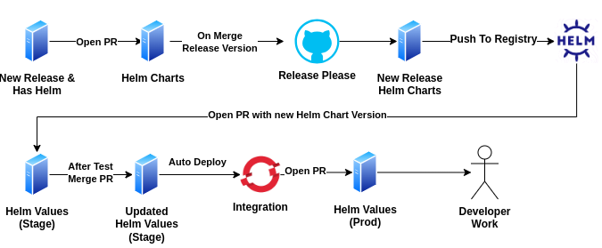

import Tabs from '@theme/Tabs';
import TabItem from '@theme/TabItem';

# Release Management Guide

This document outlines the release management process for Libot Mipuy, which involves multiple teams and services. 
The release strategy follows semantic versioning ([SemVer](https://semver.org/)) for individual services
and "Libot version" for managing deployed Libot stack on networks.

## Libot Version Tag

The **Libot Version** is an alias to a specific `helm-charts` release version. This means that it represents the entirety of all service releases for the production deployment and it's structure.

## Service Branching Strategy

Each service must maintain at least one main branch to track the latest stable release and major version updates:

1. **`master`**:
   - Represents the latest stable version of the service.
   - Merges to this branch indicate the most recent production-ready release.
   
2. **`MAJOR.x.x`** (e.g., `1.x.x`, `2.x.x`):
   - Tracks the major version series of a service.
   - A new branch is created for every major version that is smaller than the latest major version.
   - Example:
     - If a service's latest release version is `3.3.0` and a new bug fix needs to be merged to latest release with major version '2', 
       a pull request (PR) will be created for both:
       - `master` (represents 3.x.x) - only if the bug fix relevant to this release too
       - `2.x.x` (to track the new version with the fix).
     - Once merged, both branches will represent a release with the bug fix, while the `1.x.x` branch remains unchanged.

## Service Release Flow

Explanation:

1. The developer creates a PR

2. On merging to master: 
    - release-please takes action and opens a PR release with these changes:
        - Updating package.json to the new release version
        - Updating `CHANGELOG` with the new version
        - Updating `helm chart` version

    :::info
    The release version will be based on ([SemVer](https://semver.org/)) (according to the PR title)
    :::

3. On merging the release PR to master, `release-please` will create a new release

4. On new release, some automate workflows will be triggered:
    - Push to `NPM` (for libraries)
    - Build a docker image and push to registry (if a `Dockerfile` exists)
    - Pack the helm chart and push to registry (if a `helm` chart exists)

**End State:**
    - New release version based on `SemVer`
    - master points to the new release
    - New release is pushed to `npm`, `docker` and `helm` registries

:::info
The deployment part is described in the next section
:::

## Helming Strategy

:::warning
This strategy does not include the checks during development. 
It assumes that the new released service is properly checked and its updated chart is good.
All the development tests should happen before the service was released so in this flow we assume 
that the chart is good and does not require deployment in order to know if it is a good chart
:::

The project includes two different repositories that represent two different flows:

1. **Chart Flow using "Helm-Charts" repo** - Handling the new charts and versions from the services and creation of new "Libot Version"

2. **Values Flow using "Helm-Values" repo** - Handling the deployment in openshift based on the new "Libot Version" that was created in `helm-charts`

### Explanation

With this strategy, we separate the charts from the values.  

"helm-charts" repo will contain only the chart. The structure of the helm.  
"helm-values" repo will contain **only the values based on the relevant chart** 
and the "Libot Version" it based on (a file named "libot-version.json" in the repo).
The values files that represent namespaces of openshift should not be part of the structure 
(as they only config files). They should be in a different repo.  
That's way we earn:

1. **Avoiding "trash" commits**  
Imagine if we keep the values with the chart, Now if we want to change the log level from info to debug, 
we will have to commit the change in the repo itself and this shouldn't be. 
That way we will "trash" the repo with a lot with unnecessary commits that don't related to chart itself.

2. **Allowing informative versions of helm-charts**  
If we keep the chart and the values together, We will have a hard time to handle properly the release of helm-chart 
duo to the many changes on the values that does not require a new release.
From the other hand, there are changes in the values file that we want to change. Imagine that you want to change the default port to be 80. 
This is a "structure" change because you want to change a default value so it does require a new release.
So you won't know what requires a new release and what is not.
With the separated values and charts, you will have just default values in the chart so every change in that values file will require new release.

3. **One and only structure**
Currently, the charts in the network can be different from the charts in Azure because the charts can be modified. 
Using the new strategy, we make sure that there will be one source of truth and it sits in helm-charts outside the internal network and only there! 

4. **Simpler deployment**  
IF we keep them together, we will need to manage every chart (along with the values) in different branches. 
That way we will have hard time to manage the charts in all the branches.
With the new strategy, we need to "worry" only the values and the version of the chart when we deploy. We won't manage the chart anymore.  
We can only run this command template:  
`helm install myrelease oci://HELM_REGISTRY/helm-charts/raster-ingestion --version 3.1.0`  
And that's it! We don't need the chart in the repo anymore. We make the structure and the config independent to each other.

Let's walk through the flows!

### Chart Flow

This flow suppose to handle the update of new versions of services and creation of new "Libot Release".

1. When a service has a new release and helm folder (points that its chart in helm-charts needs to be updated), 
open a PR in helm-charts that update the version of the service.

:::note
The developer should see the PR and make more changes if necessary
:::

2. After the PR is ready, merge the PR.

::::info
The PR can contain multiple commits so if there are more than one service that triggered the PR (more than one chart that needs to be updated), 
the PR will contain all the changes so the merge of the PR will update the versions of all the relevant services in helm-charts.

:::tip
If there is a service that you don't want to include it yet in helm-charts, you can disable the workflow that triggers that PR
:::

::::

3. On "master" push:
    - Create a new "Libot Version" using release-please. 
    The release-please should also update the docker and helm versions of the services in:
        - `artifacts.json` file inside the domain that represent the information of all services and versions of the domain
        - `libot-artifacts.json` in the root directory that represent the information of all services and versions of **all** domains

    - Package all the charts and push them to helm registry.  
    For example:  
    On new libot release with version 3.0.1, we will push to helm registry the raster-ingestion chart with this name: `rater-ingestion-3.0.1`. 

**End State**:

* New "Libot Version" 
* Charts of the new version packed in helm registry.

Now, we have an updated structure of the chart and we can move on to the values.

### Values Flow

This flow suppose to handle the update of the namespaces values (integration and prod) and the deployment in openshift.

0. On new release, there will be a PR on stage branch in `helm-values` repo that updates the "Libot Version" in `libot-version.json` file

1. There will be an auto deploy in "integration" namespace

2. After testing it and make sure the values are OK, the developer will merge the PR

3. Once the stage branch is updated, a new PR will be automatically created in "prod" branch to update the "Libot Version" in the file

4. The developer will manually deploy using the prod values file

5. After testing it and make sure the values are OK, the developer will merge the PR to "prod" branch

**End State**:

* Updated values in all branches based on "Libot Version"
* Updated `libot-version.json` file in every branch
* Updated deployments in all namespaces in openshift

:::info
The values flow is the same flow in the network. 
There will be helm-values repo based on branches (each branch will represent a namespace in openshift) 
and in every branch there will be a file named: `libot-version.json` that will represent the related chart version
:::

## Bundle Strategy

You can see more about bundler and unbundler [here](../DevOps/pipelines/bundler-unbundler.mdx).  
The only change is that the bundler pipeline will be able to create a bundle based on the "Libot Version".  
