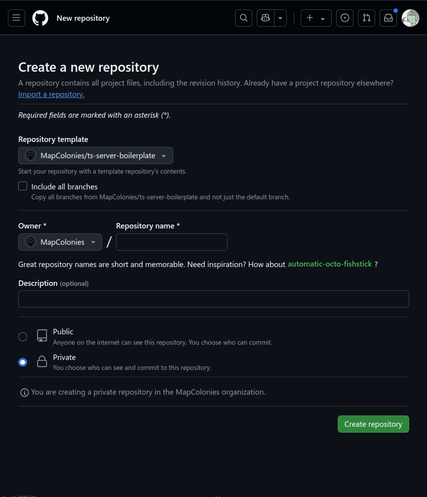

# TypeScript Server Boilerplate

This is the official MapColonies™ boilerplate for a TypeScript server using Express.js.
The boilerplate includes many features and packages in order to make the development process easier and faster and ensure common practices and standards.

## Where do i find it?

The boilerplate is available in the [MapColonies™ GitHub repository](https://github.com/MapColonies/ts-server-boilerplate)

## How do i create a new project using the boilerplate?

When creating a new project, you can use the boilerplate as a template repository in GitHub.

