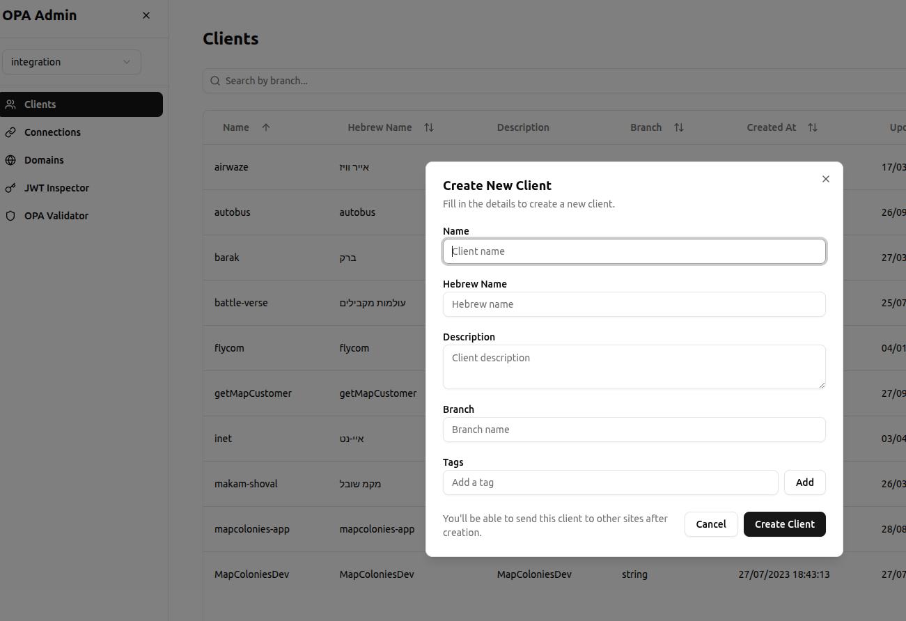
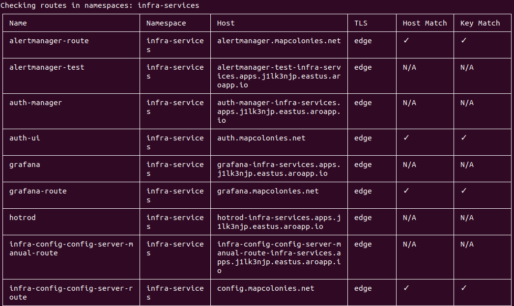
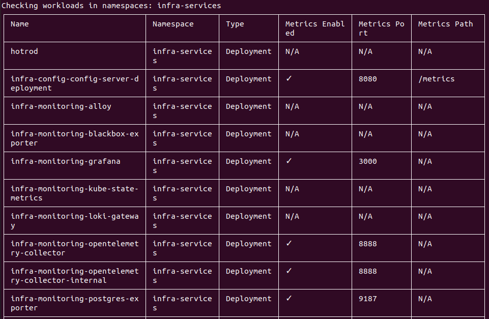
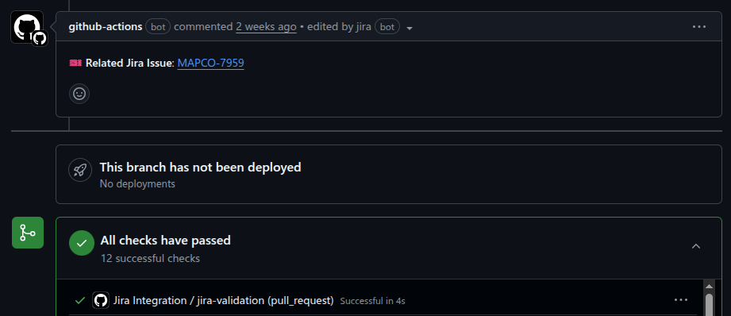

import Tabs from '@theme/Tabs';
import TabItem from '@theme/TabItem';

## 🔧 Config Management

### ✨ MAJOR Version Upgrade and Key Fixes
We've rolled out a new **MAJOR version** of our Config Management system, packed with important fixes and a game-changing new feature!

* **Support for Versioned Configs**: You can now create multiple versions of a configuration schema with the **same name**.  
    Previously, if you had a schema named `bla` and wanted to create an updated version, you couldn't use the name `bla` again.  
    Now you can! This makes managing configuration evolution much more intuitive.
* **Bug Fixes 🐛**: We've resolved some tricky issues:
    * A problem with schemas using `oneOf` and a `default` value has been fixed by enabling AJV's `discriminator` option.
    * The "unevaluated properties" error is now enriched with more context, making it much easier to debug your schemas.

---

## 🚀 CI/CD Improvements

### 🎵 From Playlists to Songs: Shared Workflows Refactor
Our [`shared-workflows`](https://github.com/MapColonies/shared-workflows) repository has been completely redesigned for flexibility!

Previously, we offered complete workflows ("playlists"), but we found that everyone needed slight variations. 
To solve this, we've broken them down into modular **actions ("songs")**. 
Now, you can build your own custom workflow ("playlist") perfectly tailored to your service's needs by picking and choosing the actions you want.

---

## 🛡️ Authentication (OPAla)

### 🎨 Welcome, OPAla UI!
Say goodbye to creating OPAla clients and connections through the Swagger API! We're thrilled to introduce the **OPAla UI**, 
a user-friendly interface for managing all your authentication needs. This new UI makes the entire process faster, more intuitive, and less error-prone.

### 🔄 Automatic Fetching of Latest Versions
OPAla just got smarter! It now supports automatically fetching the **latest version** of connections and assets.

---

## 🛠️ New Developer Tools

### [🤖 Infra CLI Tools](https://github.com/MapColonies/infra-cli)
We've launched a new **Infra CLI**, a command-line tool built with TypeScript to help you with common infrastructure tasks.

So far, it includes two handy tools:
* **Routes:** `validate-certs` - Checks OpenShift routes and validates their TLS certificates to prevent certificate-related issues.

* **Monitoring:** `metrics-annotations` - Scans your Kubernetes deployments and stateful sets to ensure they have the proper Prometheus metrics annotations.

### [🐙 Javascript-Github-Actions](https://github.com/MapColonies/javascript-github-actions)
We've created a new home for our reusable, JavaScript-based GitHub Actions. 
This repository will contain a collection of actions to simplify and standardize your CI/CD pipelines.

The first available action is:
* `jira-integration`: Helps you connect pull requests to Jira tickets, automatically adds comments with relevant info, 
and validates that the PR title contains a Jira ticket ID.

---

## 🕍 Boilerplate

### 📚 Documentation Now on Infra-Portal
To make onboarding and development smoother, we've added the complete documentation for 
our [**TypeScript boilerplate**](https://github.com/MapColonies/ts-server-boilerplate) directly to the infra-portal. 
Now you can find all the information you need in one centralized place! Right [here](/docs/knowledge-base/ts-server-boilerplate)!
