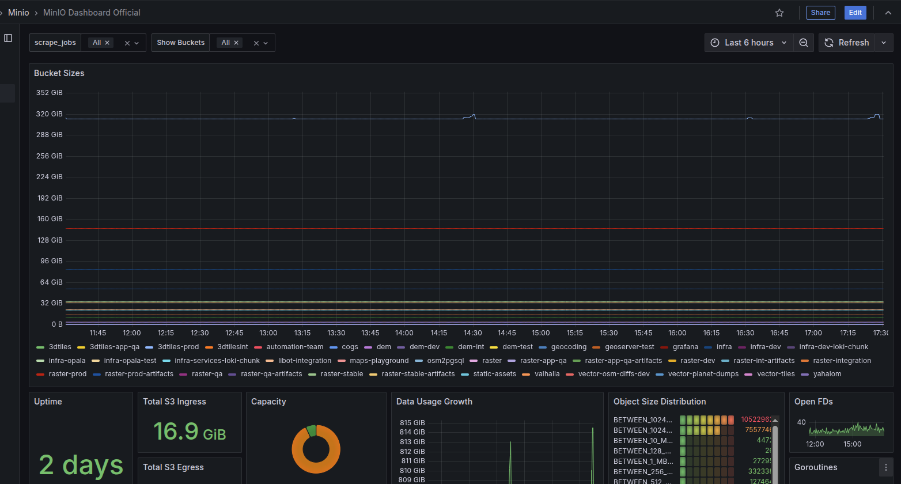

## 📊 Monitoring & Observability

### 🪵 Welcome [Loki](https://grafana.com/docs/loki/latest): Our New Logging Solution
We're excited to complete our observability! Alongside **[Prometheus](https://prometheus.io)** for metrics and **[Tempo](https://grafana.com/docs/tempo/latest)** 
for traces, we've now integrated **Loki** as our official logging solution.

Loki will aggregate logs from all our services, providing a centralized place to search, analyze, and debug.  
Logs will be processed in OpenTelemetry format via [Alloy](https://grafana.com/docs/alloy/latest).

To get started, you can enable log scraping for your service by simply adding the following label to your pods: `mapcolonies.io/alloy-api-logs: "true"`.  
After that, you can see the logs immediately [here](https://grafana.mapcolonies.net/a/grafana-lokiexplore-app/explore)

:::info
In the future, we will release a dedicated NPM logger package, so in the meantime, DO NOT set this label on your NodeJS services.
:::

### 💾 MinIO Gets a Significant Upgrade!
We've rolled out a UI and monitoring upgrade for MinIO!  
We've often faced issues where MinIO would shut down because it ran out of disk space. 
To prevent this, we've integrated robust metrics and proactive alerts to warn us long before space becomes an issue. 
Additionally, we've added a new dashboard panel that shows the size of every bucket, 
making it incredibly easy to see where space is being used and how to free it up when needed.

### ✨ Cluster Health at a Glance: New OpenShift Dashboards
Ever wonder if we're making the most of our OpenShift cluster resources?  
To help answer that question, we've launched two powerful new dashboards: 
one for overall Cluster Statistics and another for detailed Namespace Statistics.  
These dashboards give you a clear view of resource utilization, helping us spot wasted resources and find opportunities to be more efficient. 
Now you can easily see if your services are over-provisioned and help us save money and improve performance across the board!

---

## 🛡️ Authentication

### 🔑 Token Kiosk for Temporary Access
We've launched the **Token Kiosk**, a new service for issuing temporary tokens to B2C clients. 
This is especially useful for applications like ArcGIS-Pro and ArcMap, where preventing token sharing across different machines is a security priority.

**Key Features:**
* **Secure Access**: The service generates temporary tokens and can distinguish between different devices to ensure tokens aren't shared.
* **SSO Integration**: It uses an SSO to authenticate users securely.
* **User-Friendly UI**: A simple, Hebrew-language interface allows users to generate a token, view an expiration countdown, and copy the token with a single click.
* **Token Lifecycle**: Tokens are valid for one week by default, and all issuance is logged in a database for tracking.

Feel free to tell your friends and show them the kiosk [here](https://kiosk.mapcolonies.net)😉

---

## 💸 Infrastructure & Cost Optimization

### 📉 Weekend Auto-Scaler
To help reduce costs, we've implemented a new **auto-scaling tool**. This tool automatically downscales all non-prod deployments over the weekend (Azure only, not relevant to in-networks).  
Don't worry, the tool scales them back up to their original replica counts first thing on Sunday morning.  

Whenever the tool starts working, it reports everything to our slack channel *infra-notifications* so if anything goes wrong, we'll be the first one to know and fix it.

This simple change allows us to optimize our resource usage and save money without impacting performance during the work week.

---

## 🚀 CI/CD Improvements

### 🕵️ Jenkins Observability
Ever had a pipeline fail without a clear reason?  
We've enhanced our Jenkins setup with improved observability.  
This will make it significantly easier to debug pipeline issues, detect errors proactively, and understand performance bottlenecks, 
leading to a more stable and reliable CI/CD environment.

### 🛡️ Safer Deployments with Gatekeeper Guardrails
To help improve consistency, we've enabled Gatekeeper to act as a friendly guardrail for our deployments. 
It checks if your Helm charts have all the required labels and annotations needed for monitoring and automation.

Don't worry, it won't block you!
For now, it only shows a warning if something is missing, giving you a gentle nudge in the right direction.
To make it easy, you can add all the required labels using our mc-labels-and-annotations Helm library.

---

## 🗃️ Databases

### 🔒 Postgres with SSL for Local Development
We've published a [new repository](https://github.com/MapColonies/postgres-ssl) containing instructions on how to easily deploy **Postgres with SSL**.  
The repo contains also a walkthrough and friendly guide for all the complex steps, from generating all the certs files to import and use them.  
This allows developers to test their services in an environment that more closely mirrors production, 
ensuring that database connections are secure and properly configured before deployment.

What are you waiting for?😱 Go deploy your secured postgres!!

---

## 🚦 Service Health & Status

### ♟️ Checkmate - The CLI, Now as a Service
Building on our [infra-CLI](https://github.com/MapColonies/infra-cli), we're excited to introduce [Checkmate](https://github.com/MapColonies/checkmate)! 
Checkmate is a new API service that exposes the same powerful checks and tools found in our CLI. 

### ✨ New Status Page Initiative
We've begun work on a centralized **Status Page** for the entire MapColonies project. This page will be the single source of truth for questions like:
* What's the operational status of each team's services?
* What alerts are currently active?
* What is the uptime for key applications?

The status will be presented as a **Grafana dashboard**, built on metrics enriched with [MapColonies labels and annotations](https://github.com/MapColonies/labels-and-annotations) according to project requirements.

This is a collaborative effort, and soon we will be working closely with all teams to build out their respective sections on the page.  

---

## 📦 MC packages

### ✨ Unified CLI utilities for openapi-helpers package v4.0.0
**Before:** The package provided a CLI that generates types from OpenAPI specifications.

**Now:** The package has been significantly enhanced with new capabilities:
* Generates error mappings and code classes from the OpenAPI specification
* Unified CLI to generate both types and errors, providing a single source of truth
* Programmatic support is now available - you can import and use the generators directly in your code

You can find the full documentation here: [MapColonies openapi-helpers package](https://github.com/MapColonies/openapi-helpers).

---

## 🕍 Boilerplate

### 🏗️ CI Refactor: Building with Actions
Following up on our Q2 initiative to provide reusable actions ("songs") instead of monolithic workflows ("playlists"), we've updated the boilerplate's CI pipeline.  
Instead of referencing an external workflow, the CI is now built directly within the boilerplate repository itself, 
calling the specific actions it needs. This makes the CI process more transparent, flexible, and easier for you to customize.
